# De l'Annotation à la Détection : Entraîner un Modèle YOLO sur OpenShift AI


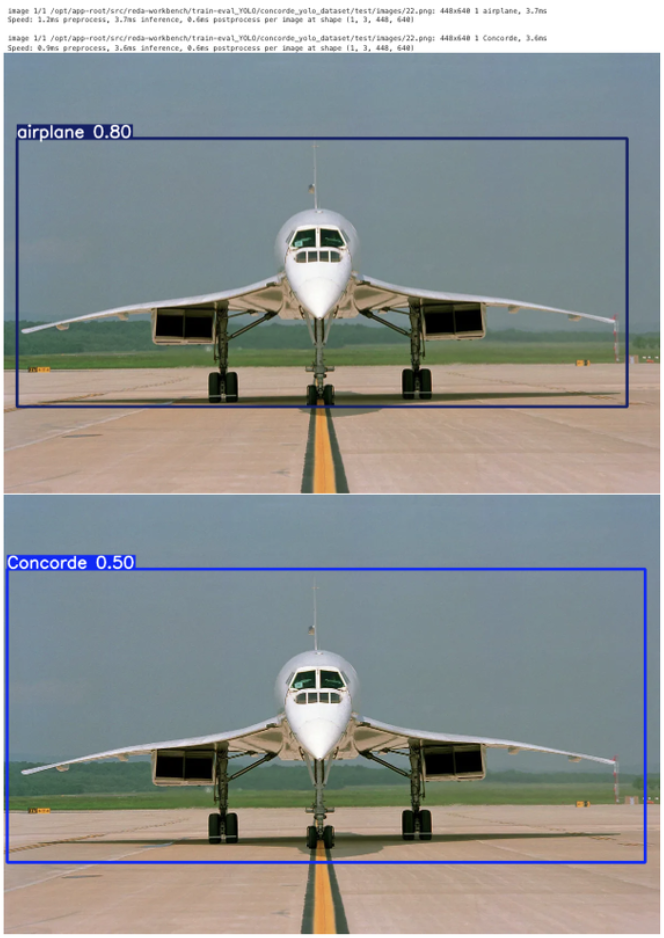{: .scaled-image } 

## Introduction

Dans le domaine de la vision par ordinateur, la performance d'un modèle de détection d'objets dépend massivement de la qualité de son jeu de données d'entraînement. Un bon modèle nécessite des milliers d'exemples correctement annotés, une tâche qui peut rapidement devenir complexe et fastidieuse. C'est ici qu'interviennent des outils spécialisés comme **CVAT** et des modèles de pointe comme **YOLO**.

**CVAT (Computer Vision Annotation Tool)** est une plateforme open-source puissante, conçue pour simplifier et accélérer l'annotation d'images et de vidéos. De son côté, YOLO (You Only Look Once) est l'un des modèles de détection d'objets en temps réel les plus populaires et performants.

Cet article vous guidera pas à pas à travers le processus complet : de l'annotation d'un jeu de données personnalisé avec CVAT à l'exportation des annotations au format YOLO, pour finalement entraîner notre propre modèle de détection d'objets.

---

## Code Source

Le dépôt GitHub ci-dessous contient tous les notebooks, scripts et fichiers de configuration nécessaires pour suivre ce tutoriel et entraîner votre propre modèle YOLO.

**[Accéder au projet sur GitHub](https://github.com/neutron-IT-organization/CVAT-YOLO-Training.git)**

## 1. Récupération du Jeu de Données via Git
Pour cette session d'annotation, le jeu de données a été préparé et mis à disposition dans un dépôt Git. La première étape consiste donc à le cloner sur votre machine locale.

Ouvrez un terminal et exécutez la commande suivante :

```bash
git clone https://github.com/neutron-IT-organization/Data-Yolo-Test.git
```
Cette commande créera un nouveau dossier sur votre ordinateur, contenant l'ensemble des images prêtes à être importées dans CVAT.

Le jeu de données fourni a été conçu pour être représentatif et diversifié, afin de garantir la qualité des annotations et la future performance du modèle. Il inclut des images sous différents angles, éclairages, et avec des arrière-plans variés. Une fois le clonage terminé, vous disposerez du dossier nécessaire pour l'étape suivante.

## 2. Déploiement et Configuration de CVAT

### 2.1 Déploiement de CVAT sur OpenShift

Avant de pouvoir annoter, nous devons déployer l'application CVAT sur notre cluster OpenShift.

#### **Prérequis**

Avant de commencer, assurez-vous de remplir les conditions suivantes :
1.  **Installer `oc`** : L'outil de ligne de commande d'OpenShift doit être installé sur votre machine.
2.  **Avoir les droits admin** : Vous devez disposer de permissions d'administrateur sur le cluster pour créer un projet et les ressources associées.
3.  **Être connecté au cluster** : Assurez-vous d'être bien authentifié à votre cluster via la commande `oc login`.

#### **Étapes du déploiement**

Suivez ces étapes depuis votre terminal pour déployer CVAT :

1.  **Clonez le dépôt Git** contenant les fichiers de configuration de CVAT.
```bash
git clone git@github.com:neutron-IT-organization/CVAT.git
```

2.  **Créez un nouveau projet** (namespace) dédié à CVAT.
```bash
oc new-project cvat
```

3.  **Naviguez dans le dossier** des manifestes de déploiement.
```bash
cd CVAT/manifest
```

4.  **Appliquez les configurations**. 
Cette commande va créer toutes les ressources nécessaires (déploiements, services, volumes, etc.) pour faire fonctionner l'application.
```bash
oc apply -f .
```

5.  **Accédez à l'interface web**. 
Une fois le déploiement terminé, allez dans la console web d'OpenShift, sélectionnez le projet `cvat`, puis naviguez dans la section **Networking > Routes**. Cliquez sur l'URL générée pour ouvrir CVAT dans votre navigateur.

6.  **Récupérez le mot de passe initial**. Pour la première connexion, un compte super-utilisateur a été créé. Pour trouver son mot de passe :
    * Dans le projet `cvat`, allez dans **Secrets**.
    * Cherchez et cliquez sur le secret nommé **`cvat-superuser`**.
    * Cliquez sur **"Reveal Values"** pour afficher le mot de passe. Le nom d'utilisateur est `admin`.

### 2.2 Création d'une Organisation

Pour travailler en équipe, la meilleure pratique est de créer une "Organisation". Cela permet de partager les projets et de gérer les permissions des différents membres.

1.  Depuis le tableau de bord, cliquez sur votre nom d'utilisateur en haut à droite, puis sur la flèche `>` à côté de **Organization**.

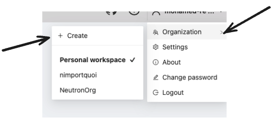

2.  Sur la page suivante, cliquez sur **`+ Create`** pour créer une nouvelle organisation.

3.  Remplissez le formulaire en donnant un nom court (*Short name*) à votre organisation (ex: `orgTest`), puis cliquez sur **`Submit`**.
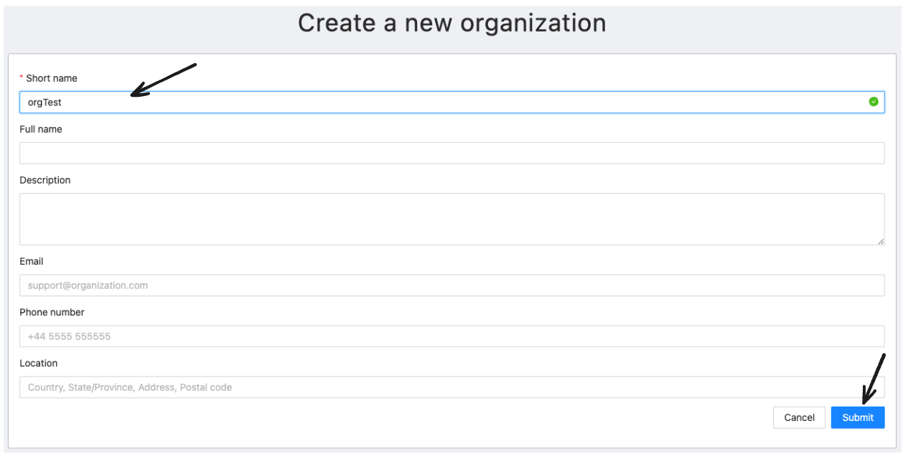

4.  Une fois créée, vous basculez automatiquement dans le contexte de votre nouvelle organisation.
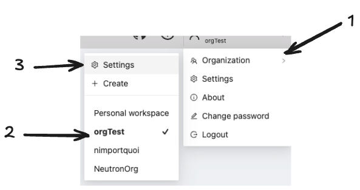

5.  Pour ajouter des collaborateurs, cliquez sur le bouton bleu **`Invite members`**.
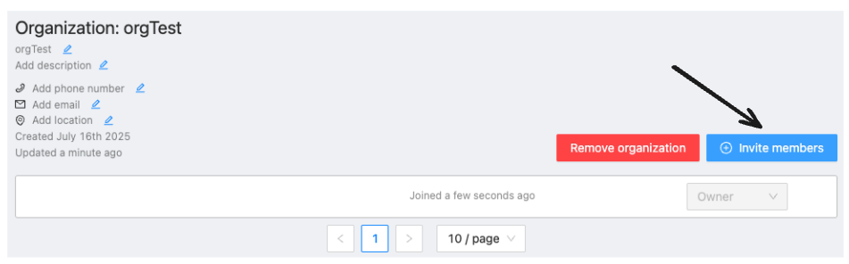

6.  Dans la fenêtre qui s'ouvre :
    1.  Entrez l'adresse e-mail de la personne à inviter.
    2.  Choisissez son rôle (`Worker`, `Supervisor`, etc.).
    3.  Cliquez sur **`OK`**.
    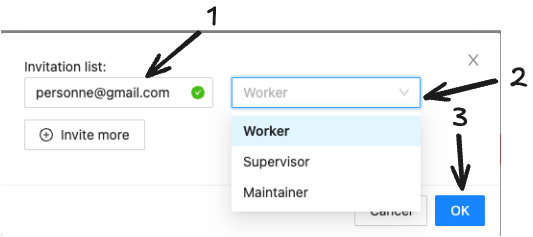

### 2.3 Création du Projet d'Annotation sur CVAT

Une fois CVAT déployé et que vous êtes connecté, vous arriverez sur le tableau de bord. C'est ici que tous vos projets d'annotation seront listés. La première étape consiste à créer un nouveau projet pour nos images du Concorde.

Comme indiqué sur la capture d'écran, cliquez sur le bouton bleu **`+`** situé en haut à droite de l'interface, puis sélectionnez l'option **`+ Create a new project`**.

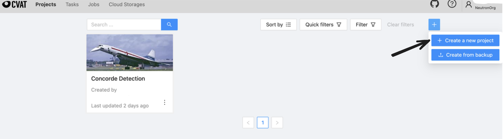{: .scaled-image }

Vous serez alors redirigé vers la page de configuration du projet. Vous devez y définir deux éléments essentiels :

1.  **Name** : Donnez un nom explicite à votre projet, par exemple "Aircraft Detection".
2.  **Labels** : C'est ici que vous déclarez les différentes classes d'objets que vous allez annoter. Pour ce guide, nous nous concentrons sur une seule classe. Cliquez sur **`Add label`** et tapez le nom **`Concorde`**.

Une fois le nom et le label configurés comme sur l'image ci-dessous, cliquez sur le bouton **`Submit`** pour créer votre projet.

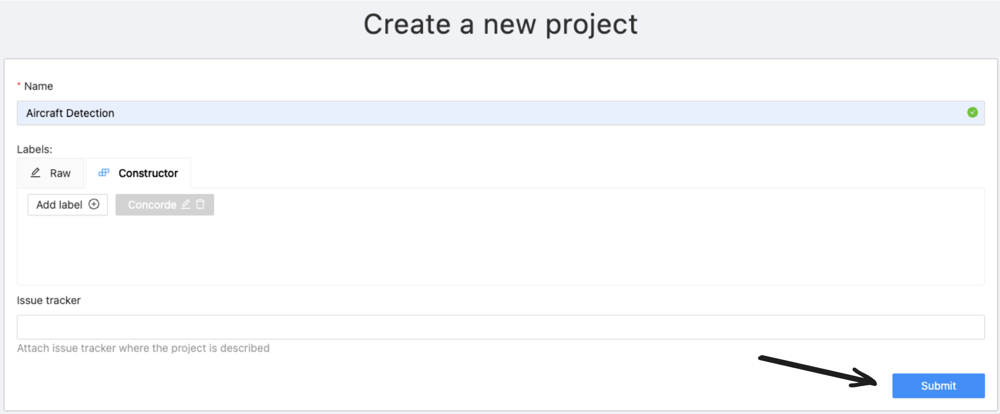{: .scaled-image }

## 3. Création d'une Tâche d'Annotation

Dans CVAT, le travail d'annotation s'effectue au sein de **tâches** (*tasks*). Une tâche contient un lot d'images à annoter et les annotations qui lui sont associées. Un projet peut contenir plusieurs tâches, ce qui est pratique pour diviser le travail ou organiser différents lots de données.

Maintenant que notre projet est prêt, nous pouvons créer notre première tâche. Depuis la page du projet, qui est pour l'instant vide, cliquez sur le bouton **`+`** situé dans le coin inférieur droit pour commencer.

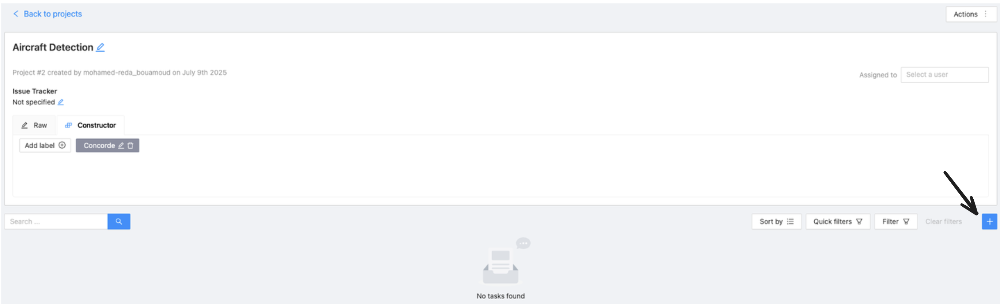{: .scaled-image } 

Cette action ouvre la page "Create a new task". Ici, vous configurez la tâche et y ajoutez vos données.

1.  **Name** : Donnez un nom à la tâche. C'est une bonne pratique de la nommer en fonction de son rôle dans le processus de Machine Learning, par exemple **`Train`**.
2.  **Select files** : C'est ici que vous importez les images préparées à la première étape. Assurez-vous d'être sur l'onglet **`My computer`**, puis cliquez sur la zone "Click or drag files to this area". Vous pouvez alors sélectionner plusieurs images ou directement le dossier complet qui les contient.

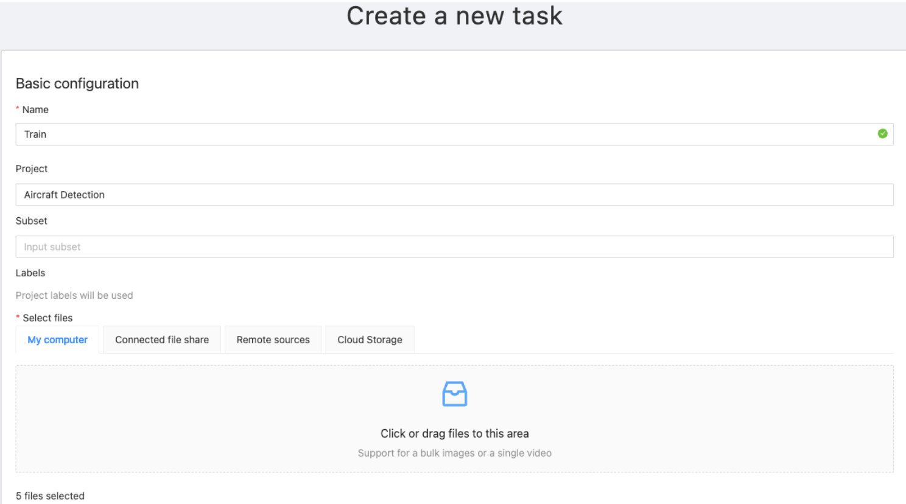{: .scaled-image } 

Enfin, avant de soumettre, descendez jusqu'à la section **`Advanced configuration`**. Assurez-vous que l'option **`Choose format`** est bien sur **`CVAT for images 1.1`**.

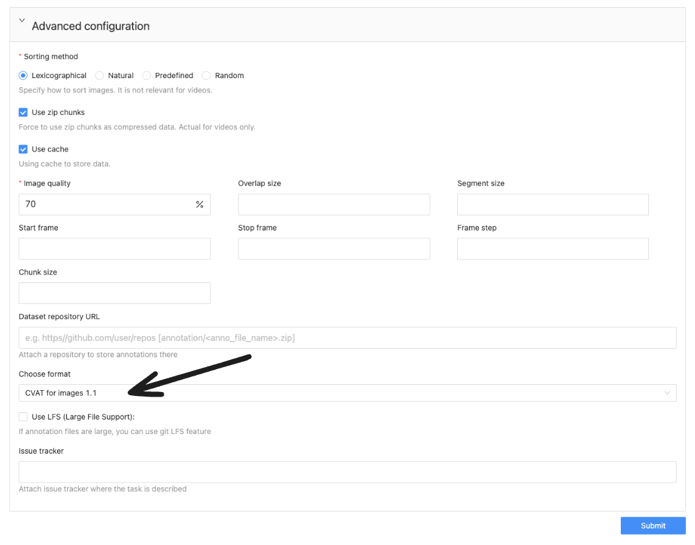{: .scaled-image } 

Cliquez ensuite sur le bouton **`Submit`** en bas de la page pour finaliser la création de la tâche.

## 4. Lancement de l'Annotation

Une fois la tâche créée et les images importées, nous sommes prêts à passer au cœur du travail : l'annotation.

Avant d'ouvrir l'éditeur, une bonne pratique consiste à spécifier à quel sous-ensemble de données cette tâche appartient. Dans le champ **`Subset`**, sélectionnez si ces images feront partie de votre jeu d'entraînement (**`Train`**), de test (**`Test`**), ou de validation (**`Validation`**). Cette métadonnée sera utile lors de l'exportation.

Ensuite, pour commencer à dessiner les boîtes englobantes, descendez à la section **`Jobs`**. Un "job" est l'unité de travail concrète. Cliquez sur le lien du job (par exemple, **`Job #...`**) pour ouvrir l'interface d'annotation.

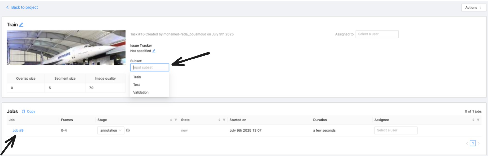{: .scaled-image } 

### L'Interface d'Annotation

Cette action ouvre l'éditeur principal. C'est ici que vous allez dessiner les boîtes englobantes sur chaque image. Le processus est simple et se déroule en plusieurs étapes, indiquées sur l'image ci-dessous :

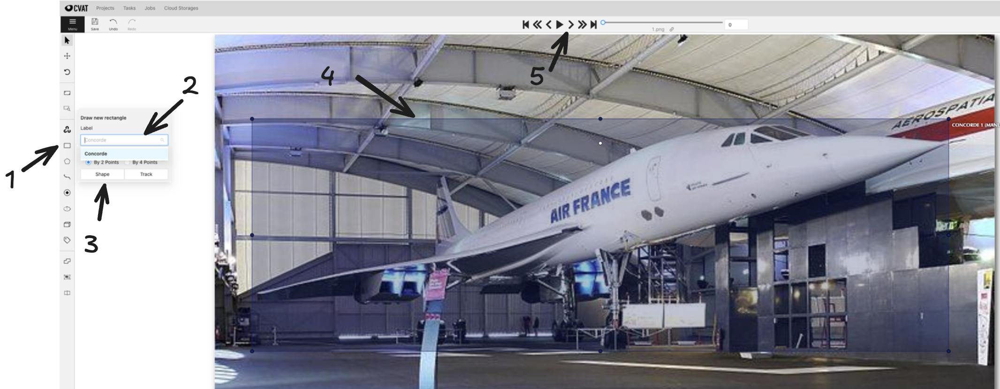{: .scaled-image } 

1.  **Sélectionner l'outil Rectangle** : Dans la barre d'outils de gauche, cliquez sur l'icône **`Draw new rectangle`** pour activer l'outil de dessin.
2.  **Choisir le bon Label** : Juste en dessous, assurez-vous que le label sélectionné est bien celui que vous voulez annoter, ici **`Concorde`**.
3.  **Confirmer la Forme** : Vérifiez que la méthode de dessin est bien "Rectangle".
4.  **Dessiner la Boîte** : Sur l'image, cliquez et faites glisser votre souris pour dessiner une boîte qui entoure l'objet d'intérêt le plus précisément possible.
5.  **Naviguer** : Une fois l'objet annoté sur une image, utilisez les flèches en haut de l'écran pour passer à l'image suivante (`>`) et répéter l'opération.

Répétez ce processus pour toutes les images de votre tâche. Pensez à cliquer régulièrement sur l'icône de sauvegarde pour enregistrer votre travail. Une fois que vous avez terminé, vous pouvez simplement fermer l'onglet ou revenir à la page de la tâche ; votre travail est sauvegardé sur le serveur CVAT.

## 5. Exporter les Annotations au Format YOLO

Une fois que toutes les images ont été soigneusement annotées, il est temps d'exporter notre travail dans un format directement utilisable par YOLO.

Pour cela, retournez sur la page de la tâche et suivez ces deux étapes :

1.  **Valider le travail** : Dans la liste des "Jobs", il est bon de changer l'état (*Stage*) à **`acceptance`**. Cela permet de marquer officiellement que le travail d'annotation pour ce lot est terminé et validé.
2.  **Lancer l'exportation** : En haut à droite de la page, cliquez sur le bouton **`Actions`**. Dans le menu qui apparaît, sélectionnez **`Export task dataset`**.

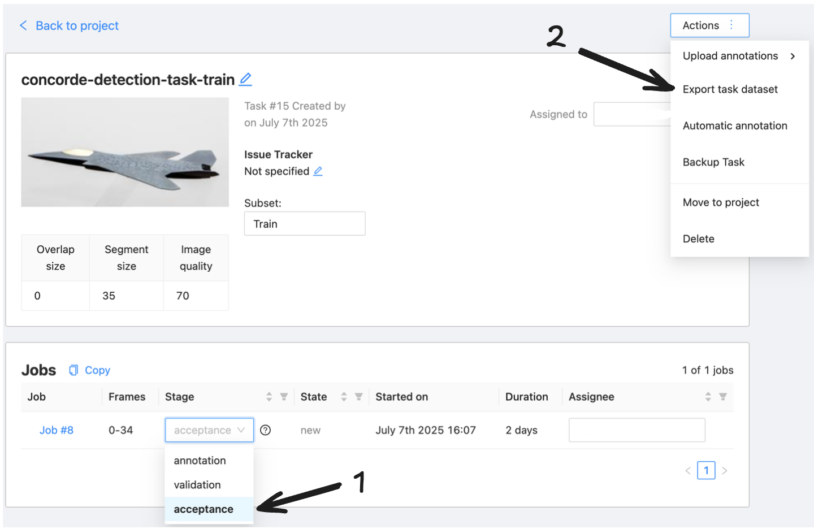{: .scaled-image } 

Une fenêtre de dialogue s'ouvre alors. C'est ici que vous finalisez les options d'exportation :

* **Export format** : Choisissez **`YOLO 1.1`** dans la liste. C'est essentiel pour obtenir des fichiers d'annotation compatibles.
* **Save images** : Cochez cette case pour inclure les images avec leurs fichiers d'annotation dans l'archive `.zip` qui sera générée.

Une fois ces options configurées, cliquez sur **`OK`** pour lancer ltéléchargement du fichier.

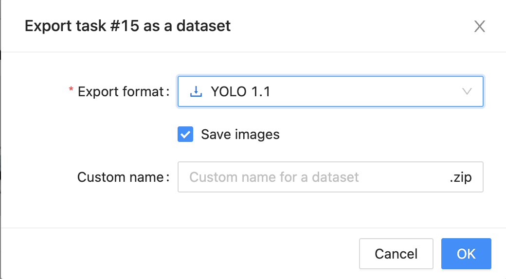{: .scaled-image }

## 6. Préparation et Centralisation du Dataset sur MinIO

Après avoir exporté vos archives `.zip` depuis CVAT pour chaque lot (train, test, validation), l'étape suivante consiste à organiser ces fichiers dans une structure de dossiers propre. Cette organisation est cruciale pour que le script d'entraînement puisse retrouver facilement les données.

Sur votre machine locale, créez un dossier principal qui contiendra l'ensemble de votre dataset (par exemple, `data_CVAT`). À l'intérieur de celui-ci, décompressez vos archives pour obtenir les sous-dossiers `test`, `train`, et `valid`. Chacun de ces dossiers doit contenir à la fois les images et leurs fichiers d'annotation `.txt` correspondants.

Votre structure de fichiers finale devrait ressembler à cet exemple :

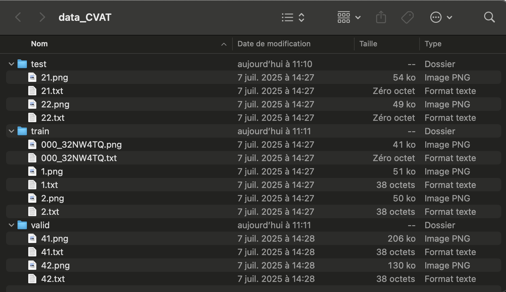

Une fois que votre dataset est bien organisé, la dernière étape est de téléverser le dossier principal (`data_CVAT`) sur votre bucket MinIO. Cela permet de centraliser vos données et de les rendre accessibles pour votre environnement d'entraînement, comme un notebook sur OpenShift AI.

## 7. Importation du Dataset pour l'Entraînement

Maintenant que notre dataset est proprement organisé et centralisé sur MinIO, nous devons établir la connexion entre notre notebook et le serveur MinIO. Pour des raisons de sécurité, les identifiants (clés d'accès) ne sont jamais écrits directement dans le code. Sur OpenShift AI, la méthode recommandée est d'utiliser une "Connexion de données", qui stocke ces informations de manière sécurisée et les rend disponibles pour votre workbench.

### 7.1. Configuration via l'Interface d'OpenShift AI
La connexion se fait en deux temps, directement dans l'interface graphique :

#### 7.1.1. Créer une Connexion de Données : 
Dans votre projet sur OpenShift AI, allez dans la section "Connexions de données" et cliquez sur "Ajouter une connexion de données". Remplissez les champs avec les informations de votre serveur MinIO :

Nom de la connexion : Un nom descriptif (ex: Connexion MinIO Projet Yolo).

Access key ID : Votre clé d'accès MinIO.

Secret access key : Votre clé secrète MinIO.

Endpoint : L'URL de votre service MinIO.

{: .scaled-image } 
{: .scaled-image } 
{: .scaled-image } 

#### 7.1.2. Lier la Connexion au Workbench : 

Lors de la configuration de votre workbench (ou en le modifiant), descendez jusqu'à la section "Connexions de données". Sélectionnez dans la liste déroulante la connexion que vous venez de créer.

{: .scaled-image } 
{: .scaled-image } 
{: .scaled-image } 

En faisant cela, OpenShift AI va automatiquement injecter les identifiants de cette connexion comme variables d'environnement (AWS_ACCESS_KEY_ID, AWS_SECRET_ACCESS_KEY, AWS_S3_ENDPOINT) dans l'environnement de votre notebook.

Maintenant, nous allons utiliser un script Python dans notre environnement d'entraînement pour simplement télécharger ce dataset depuis MinIO et le rendre disponible localement pour l'entraînement.

### 7.2. Configuration et Connexion

La première partie du script consiste à définir les chemins et à établir une connexion sécurisée avec notre serveur MinIO en utilisant les variables d'environnement.

```python
import os
import boto3
import shutil
import yaml

# Configuration des chemins et du client MinIO
OUTPUT_DATASET_PATH = "concorde_yolo_dataset"
S3_SOURCE_PREFIX = "data_CVAT" # Le dossier téléversé à l'étape précédente

# Connexion sécurisée au client S3
client = boto3.client(
    "s3",
    endpoint_url=os.environ.get("AWS_S3_ENDPOINT"),
    aws_access_key_id=os.environ.get("AWS_ACCESS_KEY_ID"),
    aws_secret_access_key=os.environ.get("AWS_SECRET_ACCESS_KEY")
)
```

### 7.3. Téléchargement et Restructuration
La fonction principale du script parcourt les dossiers `train`, `test` et `valid` sur MinIO. Pour chaque fichier, elle le télécharge et le place dans la structure de dossiers requise par YOLO (`images/` et `labels/`).

```python
def download_and_restructure_s3_folder(bucket, s3_prefix, local_base_path):
    """
    Télécharge et restructure un dossier depuis S3 (MinIO) vers la structure YOLO.
    """
    with ThreadPoolExecutor(max_workers=10) as executor:
        paginator = client.get_paginator('list_objects_v2')
        pages = paginator.paginate(Bucket=bucket, Prefix=s3_prefix)
        
        all_objects = [obj for page in pages for obj in page.get('Contents', [])]

        if not all_objects:
            print(f"Aucun objet trouvé dans {bucket}/{s3_prefix}. Le script va s'arrêter.")
            return

        with tqdm(total=len(all_objects), desc="Traitement des fichiers", unit="file") as pbar:
            futures = []
            for obj in all_objects:
                key = obj['Key']
                if key.endswith('/'):
                    pbar.update(1)
                    continue

                file_extension = os.path.splitext(key)[1].lower()
                is_image = file_extension in ['.jpg', '.jpeg', '.png']
                is_label = file_extension == '.txt'

                if not is_image and not is_label:
                    pbar.update(1)
                    continue
                
                try:
                    split_type = key.replace(s3_prefix, '').strip('/').split('/')[0]
                    if split_type == 'valid':
                        split_type = 'valid'
                except IndexError:
                    continue

                subfolder = 'images' if is_image else 'labels'
                file_name = os.path.basename(key)
                local_file_path = os.path.join(local_base_path, split_type, subfolder, file_name)

                os.makedirs(os.path.dirname(local_file_path), exist_ok=True)
                
                future = executor.submit(client.download_file, bucket, key, local_file_path)
                future.add_done_callback(lambda p: pbar.update(1))
                futures.append(future)

            for future in futures:
                future.result()
```

### 7.4. Création du Fichier data.yaml
Une fois les données structurées, une fonction génère le fichier `data.yaml`. Ce fichier est indispensable pour YOLO : il lui indique où trouver les différents ensembles de données et quelles sont les classes à apprendre.

```python
def create_yaml_file(output_path):
    yaml_content = {
        'train': os.path.abspath(os.path.join(output_path, 'train', 'images')),
        'val': os.path.abspath(os.path.join(output_path, 'valid', 'images')),
        'test': os.path.abspath(os.path.join(output_path, 'test', 'images')),
        'nc': 1,
        'names': ['Concorde']
    }
    
    yaml_file_path = os.path.join(output_path, 'data.yaml')
    with open(yaml_file_path, 'w') as f:
        yaml.dump(yaml_content, f, sort_keys=False)
```

### 7.5. Exécution
Enfin, le script principal orchestre ces étapes : il nettoie l'environnement, lance le téléchargement et la restructuration, puis crée le fichier `data.yaml`, rendant le dataset prêt pour l'entraînement.

```python
# --- 5. Script principal ---
if __name__ == "__main__":
    if os.path.exists(OUTPUT_DATASET_PATH):
        print(f"Nettoyage du répertoire existant : {OUTPUT_DATASET_PATH}")
        shutil.rmtree(OUTPUT_DATASET_PATH)
    
    print(f"Début du téléchargement et de la restructuration depuis '{S3_SOURCE_PREFIX}'...")
    download_and_restructure_s3_folder(AWS_S3_BUCKET, S3_SOURCE_PREFIX, OUTPUT_DATASET_PATH)
    
    create_yaml_file(OUTPUT_DATASET_PATH)
    
    print("\n Processus terminé. Votre dataset est prêt dans le dossier :", OUTPUT_DATASET_PATH)
```

## 8. Entraînement du Modèle avec YOLO
Maintenant que notre dataset est importé, structuré et prêt à l'emploi avec son fichier `data.yaml`, nous pouvons passer à l'étape la plus excitante : l'entraînement de notre modèle de détection d'objets. Le processus utilisera le transfer learning, une technique qui consiste à partir d'un modèle déjà pré-entraîné pour l'adapter à notre besoin spécifique, ce qui est plus rapide et efficace.

### 8.1. Préparation du Modèle de Base YOLO

Pour le transfer learning, notre point de départ est un modèle pré-entraîné, généreusement mis à disposition par l'équipe Ultralytics. Nous allons le télécharger directement depuis leur dépôt GitHub.

**Accéder au Dépôt GitHub**

Rendez-vous sur la page officielle du projet en cliquant sur ce lien : [https://github.com/ultralytics/ultralytics/tree/main?tab=readme-ov-file](https://github.com/ultralytics/ultralytics/tree/main?tab=readme-ov-file).

**Trouver le Tableau des Modèles**

Sur la page principale, faites défiler vers le bas jusqu'à la section du `README` qui présente les différents modèles disponibles. Vous y trouverez un tableau intitulé **"Detection (COCO)"**, comme celui ci-dessous. Ce tableau liste les différentes variantes du modèle, leurs performances et leurs tailles.

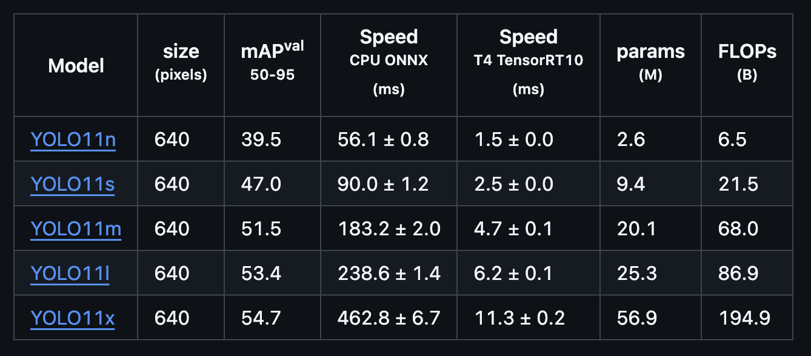{: .scaled-image } 

**Télécharger le Modèle**

Chaque nom dans la colonne **"Model"** est un lien de téléchargement direct. Pour notre guide, nous allons utiliser la version "nano", qui est légère et rapide, idéale pour commencer.

**Repérez la ligne `YOLOv11n` et cliquez dessus** 

Le téléchargement du fichier `yolov11n.pt` démarrera automatiquement.

Une fois que vous avez ce fichier sur votre ordinateur, l'étape suivante consiste à le téléverser dans votre bucket MinIO, où il sera accessible pour notre script d'entraînement.

### 8.2. Installation et Configuration
La première étape dans notre notebook d'entraînement est d'installer la librairie `ultralytics` qui contient l'implémentation de YOLO, puis de définir nos configurations.

```python
# 1. Installation de la librairie Ultralytics
!pip install ultralytics

# 2. Import des librairies nécessaires
from ultralytics import YOLO
import os

# 3. Configuration des hyperparamètres de l'entraînement
EPOCHS = 100
IMGSZ = 640
NB_FROZEN_LAYER = 10 # Nombre de couches du modèle à "geler" (ne pas ré-entraîner)

# 4. Définition des chemins importants
DATA_CONFIG_PATH = './concorde_yolo_dataset/data.yaml'
BASE_MODEL_PATH = "yolov11n.pt" # Modèle pré-entraîné qui servira de base
```

Ici, nous définissons des paramètres clés comme le nombre d'époques (cycles d'entraînement), la taille des images, et le nombre de couches du modèle que nous allons "geler". Geler des couches signifie qu'elles ne seront pas modifiées pendant l'entraînement, conservant ainsi les connaissances générales acquises lors de leur pré-entraînement.

### 8.3. Chargement du Modèle de Base
Nous n'entraînons pas un modèle à partir de zéro. Nous téléchargeons un modèle YOLOv11 pré-entraîné (`yolov11n.pt`) depuis notre stockage MinIO. Ce modèle sait déjà reconnaître des formes et des textures générales, nous n'avons plus qu'à lui apprendre à reconnaître spécifiquement le "Concorde".

```python
# Connexion au client S3...
# ...
# Téléchargement du modèle de base depuis MinIO
client.download_file(AWS_S3_BUCKET, BASE_MODEL_PATH, "yolov11n.pt")
```

### 8.4. Lancement de l'Entraînement
Avec le modèle de base et le dataset prêts, une seule ligne de code suffit pour lancer l'entraînement.

```python
# Charger le modèle pré-entraîné
model = YOLO('yolov11n.pt')

# Lancer l'entraînement
results = model.train(
    data=DATA_CONFIG_PATH, 
    epochs=EPOCHS, 
    imgsz=IMGSZ, 
    freeze=NB_FROZEN_LAYER,
    batch=-1 # -1 pour un ajustement automatique du batch size
)
```

YOLO s'occupe de tout : il charge les données, augmente le dataset (data augmentation), entraîne le modèle pendant 100 époques, et sauvegarde les résultats, y compris les "poids" du meilleur modèle obtenu.

### 8.5. Exportation et Sauvegarde des Résultats
Une fois l'entraînement terminé, la bonne pratique est d'exporter le modèle au format **ONNX**. C'est un format standard qui facilite le déploiement sur différentes plateformes.

Ensuite, nous téléversons les résultats importants sur **MinIO** pour les conserver et les utiliser plus tard :

* Le meilleur modèle au format `.pt` (natif PyTorch).
* Le modèle exporté au format `.onnx`.
* Le fichier `results.csv` qui contient les métriques de performance de l'entraînement.

```python
# Charger les meilleurs poids obtenus après l'entraînement
model = YOLO('runs/detect/train/weights/best.pt')

# Exporter au format ONNX
model.export(format="onnx")

# Téléverser les modèles et les résultats sur MinIO
client.upload_file('runs/detect/train/weights/best.onnx', ...)
client.upload_file('runs/detect/train/weights/best.pt', ...)
client.upload_file('runs/detect/train/results.csv', ...)
```

## 9. Comparaison et Validation des Résultats
Après avoir entraîné notre modèle, l'étape finale est de vérifier qu'il est bien meilleur que le modèle de base pour notre tâche spécifique. Nous allons effectuer une comparaison à la fois quantitative (avec des métriques de performance) et qualitative (en visualisant les détections).

### 9.1. Comparaison Quantitative : Mesurer la Performance
La première méthode est de mesurer la performance de chaque modèle sur notre jeu de test à l'aide de la fonction `.val()`. Cette fonction calcule des métriques standards comme la mAP (mean Average Precision), qui est un excellent indicateur de la précision d'un modèle de détection.

Le script charge les deux modèles (le modèle de base et notre nouveau modèle) puis exécute la validation sur les deux.

```python
from ultralytics import YOLO

# Charger les deux modèles
model_base = YOLO("/tmp/base-model.pt") # Le modèle YOLOv11n original
model_new = YOLO("/tmp/new-model.pt")  # Notre modèle fine-tuné

# Lancer la validation pour chaque modèle sur le même jeu de test
print("Validation du modèle de base :")
results_base = model_base.val(data="concorde_yolo_dataset/data.yaml")

print("\\nValidation de notre nouveau modèle :")
results_new = model_new.val(data="concorde_yolo_dataset/data.yaml")
```

L'objectif est de constater que la mAP pour la classe "Concorde" est très faible (voire nulle) pour le modèle de base, et significativement plus élevée pour notre modèle spécialisé.

### 9.2. Comparaison Qualitative : Visualiser la Détection
Les chiffres sont importants, mais une inspection visuelle est souvent plus parlante. Le script suivant sélectionne aléatoirement 5 images de notre jeu de test et lance la détection avec les deux modèles pour chacune d'entre elles.

```python
import random

# Sélectionner 5 images de test au hasard
image_filenames = os.listdir("concorde_yolo_dataset/test/images")
random_images = random.sample(image_filenames, 5)

# Pour chaque image, afficher la détection des deux modèles
for image_file in random_images:
    test_image_path = os.path.join("concorde_yolo_dataset/test/images", image_file)
    
    # Inférence avec le modèle de base
    print(f"\\n--- Détection avec le modèle DE BASE sur {image_file} ---")
    res_base = model_base(test_image_path)
    res_base[0].show()

    # Inférence avec notre nouveau modèle
    print(f"--- Détection avec notre NOUVEAU modèle sur {image_file} ---")
    res_new = model_new(test_image_path)
    res_new[0].show()
```

Le résultat attendu est clair : le modèle de base détectera l'avion mais avec une étiquette générique ("airplane"), tandis que notre modèle dessinera une boîte précise avec le label correct "Concorde", prouvant ainsi le succès de notre spécialisation.

{: .scaled-image } 

Il est également important de noter le comportement du modèle face à des avions qui ne sont pas des Concordes. Comme notre entraînement s'est focalisé exclusivement sur la classe "Concorde", le modèle a appris à ignorer les autres types d'avion, comme le montre l'exemple ci-dessous. C'est la preuve de sa spécialisation : il ne se contente pas de trouver des avions, il trouve **uniquement** des Concordes.

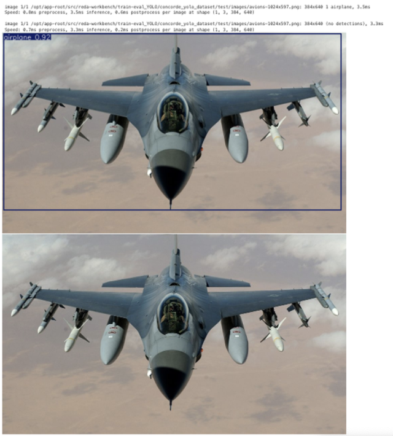{: .scaled-image } 

---

## Conclusion Générale
À travers ce guide, nous avons parcouru l'ensemble du cycle de vie d'un projet de vision par ordinateur : de la collecte d'images à l'annotation précise avec CVAT, en passant par la structuration des données et l'entraînement d'un modèle YOLO sur OpenShift. Vous avez pu constater comment le transfer learning permet, avec un jeu de données relativement modeste, de spécialiser un modèle puissant pour une tâche de détection personnalisée.

La clé du succès réside dans la qualité des données annotées et une méthodologie structurée. Vous êtes maintenant prêt à appliquer ces étapes à vos propres projets pour détecter n'importe quel objet !

---

**Auteur : [Mohamed-Reda BOUAMOUD](https://www.linkedin.com/in/mohamed-reda-bouamoud-1297a3248/)**