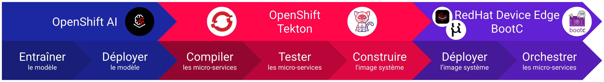

# L'Edge IA dans l'écosystème RedHat

## 1. Qu'est-ce que l'Edge IA

L'Edge IA, ou intelligence artificielle en périphérie, désigne le traitement des données par des algorithmes d'IA directement sur les appareils où les données sont générées, plutôt que dans un data center centralisé. Cela permet de réduire la latence, d'améliorer la sécurité et de diminuer la bande passante nécessaire pour le transfert de données.

### 1.1 Avantages de l'Edge IA

- **Réduction de la latence** : En traitant les données localement, le temps de réponse peut être rapide et maîtrisé afin de répondre aux enjeux industriels.
- **Sécurité améliorée** : Les données sensibles peuvent être traitées localement, réduisant les risques de fuites.
- **Bande passante optimisée** : Moins de données doivent être envoyées vers le cloud, ce qui réduit les coûts et la congestion du réseau.
- **Autonomie** : Les appareils peuvent fonctionner de manière autonome, même sans connexion Internet.
- **Évolutivité** : Facilite l'ajout de nouveaux appareils et capteurs sans surcharger le réseau central.

### 1.2 Cas d'utilisation

- **Véhicules autonomes** : Traitement en temps réel des données des capteurs pour une conduite sécurisée.
- **Usines intelligentes** : Surveillance et maintenance prédictive des équipements.
- **Robotique** : Gestion des mouvements dans l'espace et reconnaissance d'objets.
- **Santé** : Surveillance en temps réel des patients et diagnostic rapide.
- **Villes intelligentes** : Gestion du trafic, surveillance environnementale et sécurité publique.

## 2. Entraîner, Fine-Tuner, Déployer son modèle avec OpenShift AI

La première étape de votre projet Edge IA est la création de votre modèle pour répondre à vos besoins spécifiques. Pour cette étape, OpenShift AI est un allié de choix vous permettant dans un même environnement au sein d'un cluster OpenShift de :

- Mettre en place un workbench pour créer votre environnement isolé Jupyter Notebook.
- Mettre en place des pipelines pour automatiser les processus de formation et de déploiement.
- Déployer des modèles pour les tester et les valider.

OpenShift AI vous permet de gérer l'intégralité du cycle de vie de votre modèle, de la création à la mise en production.

## 3. Compiler, Tester, Déployer ses micro-services avec OpenShift et Tekton

Une fois votre modèle sélectionné, entraîné et testé, vient le développement de vos micro-services pour capter et traiter vos données ainsi que pour exécuter la réponse adaptée. Par exemple, vous pourriez vouloir manipuler un objet dans un environnement 3D à l'aide d'un bras robot et de caméras 3D. Dans ce cadre-là, vous souhaiteriez développer, tester et déployer les micro-services suivants :

- Acquisition des images et des nuages de points.
- Modèle IA de reconnaissance d'objets.
- Calcul des coordonnées des objets détectés.
- Commande du bras robot.
- MQTT et/ou Kafka.

Dans ce cadre-ci, OpenShift et Tekton vont vous permettre de réaliser votre chaîne CI/CD de développement pour vérifier la qualité de votre code, construire et pousser vos images conteneurs dans votre registry, et déployer vos micro-services dans un environnement de test au sein de votre cluster OpenShift.

## 4. Déployer, Exécuter, Orchestrer avec BootC et RedHat Device Edge

Votre stack micro-service validée, vous allez souhaiter la déployer sur vos composants Edge, un Nvidia Jetson par exemple. Une solution de choix est RedHat Device Edge qui intègre MicroShift pour orchestrer l'ensemble de vos micro-services ainsi que la stabilité et la large compatibilité de RHEL permettant de profiter dans les meilleurs conditions du GPU intégré de Nvidia.

Si vous souhaitez vous simplifier les déploiements et les mises à jour, il est possible de coupler RedHat Device Edge avec BootC permettant de créer des images de conteneurs bootables de votre système et de gérer facilement le déploiement et la mise à jour à l'aide de votre registry interne.

## Conclusion

L'Edge IA représente une avancée majeure dans le domaine de l'intelligence artificielle, offrant des solutions innovantes pour traiter les données localement, réduire la latence et améliorer la sécurité. Dans l'écosystème RedHat, cette technologie trouve un terrain fertile pour se développer et se déployer efficacement.

Grâce à des outils comme OpenShift AI, les développeurs et les data scientists peuvent entraîner, affiner et déployer leurs modèles de manière intégrée et efficace. OpenShift et Tekton permettent ensuite de compiler, tester et déployer des micro-services, assurant ainsi une chaîne CI/CD robuste et fiable. Enfin, avec RedHat Device Edge et BootC, le déploiement et l'orchestration des applications Edge deviennent plus simples et plus sécurisés, permettant une gestion optimale des ressources et des mises à jour.

En adoptant ces technologies, les entreprises peuvent non seulement améliorer leurs opérations et réduire leurs coûts, mais aussi ouvrir la voie à de nouvelles innovations dans des domaines tels que les véhicules autonomes, les usines intelligentes et la robotique. L'Edge IA, couplée à l'écosystème RedHat, offre ainsi une plateforme puissante pour transformer les données en actions intelligentes et en temps réel.

L'avenir de l'Edge IA s'annonce prometteur, et avec les outils et les technologies disponibles aujourd'hui, les possibilités sont presque illimitées. Il est temps pour les entreprises de saisir ces opportunités et de se positionner à l'avant-garde de cette révolution technologique.

---

**Auteur : [Romain GASQUET](https://www.linkedin.com/in/romain-gasquet/)**