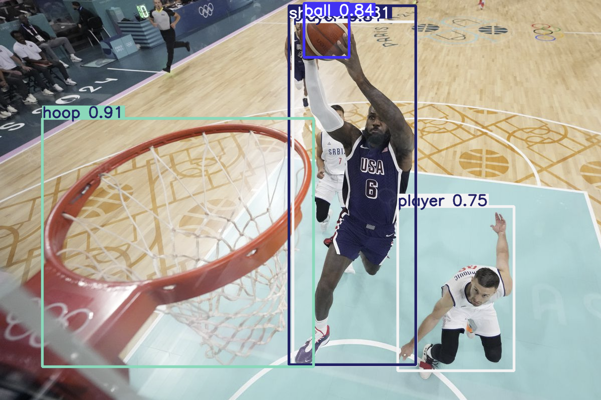
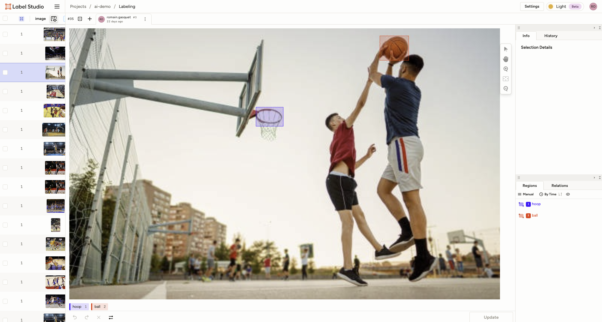
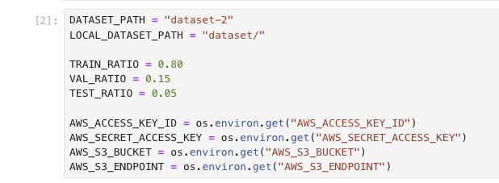
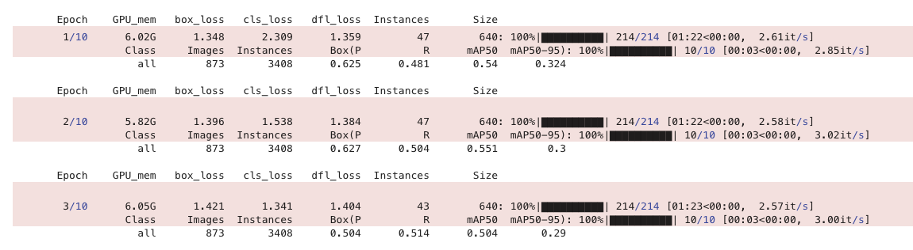
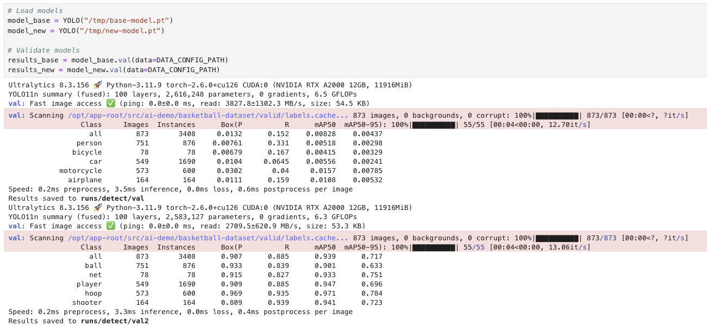
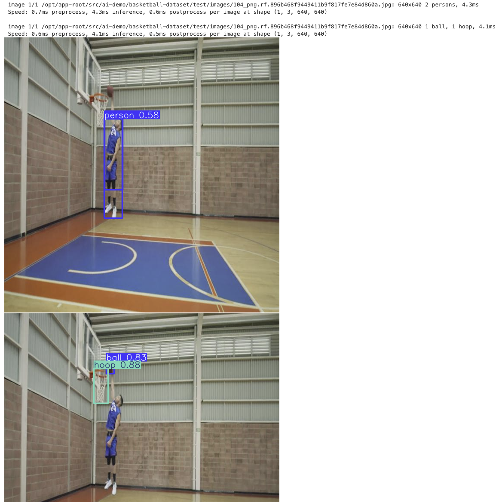

# Entraînement et évaluation d'un modèle YOLO



## Introduction

YOLO (You Only Look Once) est un modèle populaire pour la détection d'objets en temps réel. Il est largement utilisé pour sa rapidité et sa précision. Cet article vous guidera à travers les étapes pour entraîner et évaluer un modèle YOLO.

## Prérequis

Avant de commencer, assurez-vous de remplir les conditions suivantes :

- Être en mesure de se connecter à un Jupyter NoteBook ayant accès à un GPU.
- Cloner le dépôt suivant pour disposer des fichiers nécessaires :

```shell
git clone https://github.com/neutron-IT-organization/ai-demo.git
```

## 1. Créer son dataset

Pour constituer votre dataset vous pouvez :

- Télécharger un dataset opensource tel que COCO ou Pascal VOC.
- Créer votre propre dataset.

Pour la création de votre propre dataset, des outils comme Label Studio peuvent être utilisés pour annoter les images pertinentes pour votre projet. Dans cet exemple, nous utiliserons des images de basket.



Une fois les images annotées, vous pouvez exporter le modèle au format YOLO avec les images. Pour cet article, le dataset sera stocké dans un bucket MinIO.

## 2. Importer son dataset dans son environnement de travail

Vous pouvez maintenant utiliser le fichier `import-dataset.ipynb` pour importer votre dataset dans votre environnement de travail ainsi que le séparer en trois sous-ensembles : 

- un d'entraînement
- un d'évaluation
- un de test

Vous pouvez spécifier le chemin d'accès à votre dataset au sein de votre bucket, ainsi que le chemin de destination dans votre environnement de travail à l'aide des variables DATASET_PATH et LOCAL_DATASET_PATH.



## 3. Entraîner le modèle sur son dataset

Vous pouvez maintenant utiliser le fichier `transfer-learning.ipynb` pour entraîner votre modèle sur votre dataset.

Dans notre exemple, nous utilisons YOLO11n que vous pouvez retrouver sur le site l'Utralytics : [docs.ultralytics.com/tasks/detect/#models](https://docs.ultralytics.com/tasks/detect/#models). 

Pour obtenir le modèle qui correspond le mieux à vos exigences, vous pouvez modifier les paramètres d'entraînement :

- **IMGSZ** : La taille des images utilisées pour l'entraînement.
- **NB_FROZEN_LAYER** : Le nombre de couches gelées pendant le transfert de l'apprentissage.
- **EPOCHS** : Le nombre d'itérations d'entraînement.

Afin d'entraîner votre modèle sur votre dataset, vous devez avoir un fichier `data.yaml` qui décrit votre dataset.  
Voici un exemple de fichier : 
```yaml
names:
  0: Ball
  1: Hoop
path: ../dataset
test: images/test
train: images/train
val: images/val
```



## 4. Comparer les performances des modèles

Vous pouvez maintenant utiliser le fichier `comparaison.ipynb` pour comparer votre modèle au modèle de base.  
Nous pouvons analyser les résultats à l'aide des valeurs suivantes :

- **P** (Précision) : Mesure la proportion des détections positives qui sont correctes. Une valeur proche de 1 est meilleure.
- **R** (Rappel) : Mesure la proportion des objets pertinents détectés correctement. Une valeur proche de 1 est meilleure.
- **mAP50** : La précision moyenne calculée à un seuil de chevauchement de 50%. Une valeur proche de 1 est meilleure.
- **mAP50-95** : La précision moyenne calculée sur différents seuils de chevauchement, allant de 50% à 95% avec un pas de 5%. Une valeur proche de 1 est meilleure.



De manière plus visuel, voici le résultat que cela donne :


## 5. Changer les paramètres et itérer

N'hésitez pas à expérimenter avec différents paramètres pour trouver le modèle qui répond le mieux à vos besoins. Documentez vos résultats pour chaque itération afin de pouvoir comparer les performances.

## Conclusion

Cet article vous a guidé à travers les étapes essentielles pour entraîner et évaluer un modèle YOLO. Vous avez appris à créer et importer un dataset, entraîner le modèle, comparer ses performances, et itérer pour améliorer les résultats. La clé pour obtenir un bon modèle réside dans l'expérimentation et l'itération continue. Nous vous encourageons à essayer différentes configurations et à observer comment chaque changement affecte les performances de votre modèle.

---

**Auteur : [Romain GASQUET](https://www.linkedin.com/in/romain-gasquet/)**