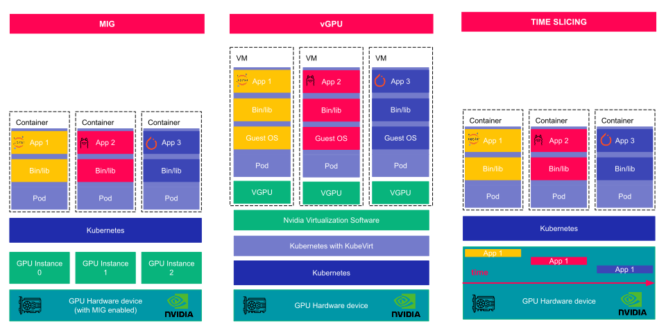
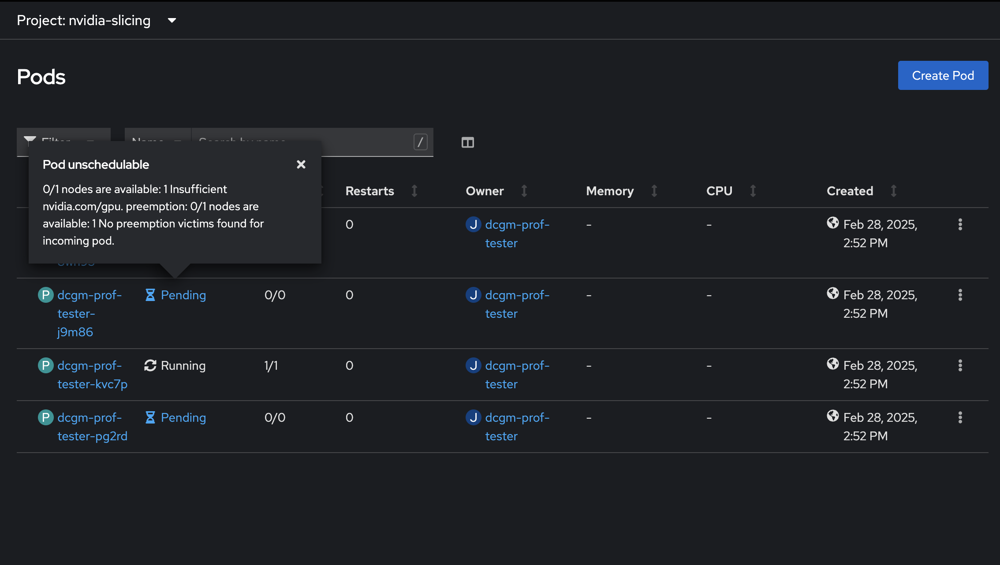
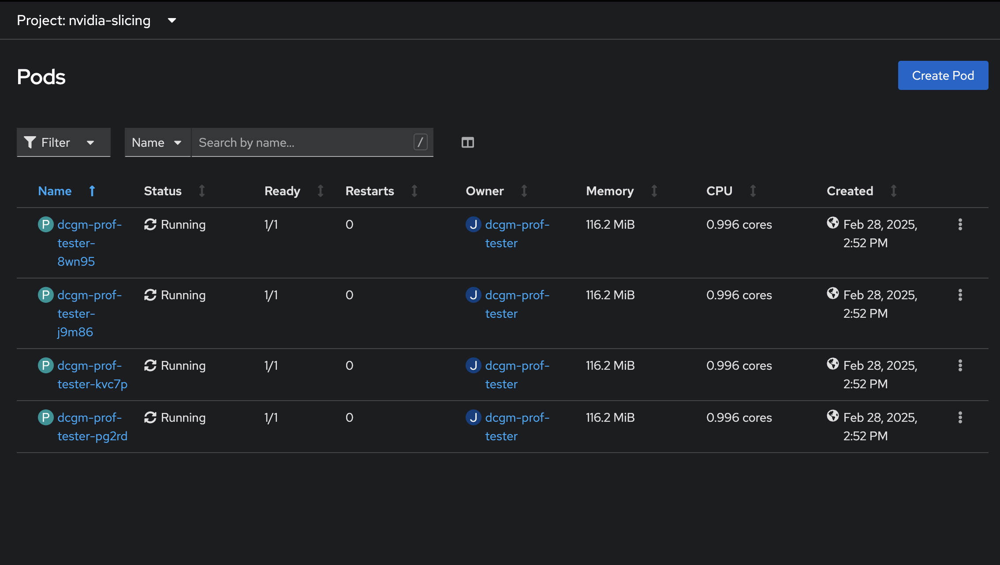

# Configuration de GPU sur OpenShift

## Introduction

Dans le monde de l'informatique moderne, l'optimisation des ressources est cruciale pour maximiser les performances et réduire les coûts. Les GPU (Graphics Processing Units) jouent un rôle central dans de nombreuses applications, allant de l'intelligence artificielle au rendu graphique. Cependant, leur utilisation efficace dans un environnement de conteneurs comme OpenShift peut être un défi. Ce document vous guidera à travers les différentes méthodes de partage de GPU sur OpenShift, en mettant l'accent sur le Time Slicing, et vous montrera comment le configurer pour améliorer l'utilisation des ressources GPU.



## Pourquoi Partager les GPU ?

Les GPU sont des ressources coûteuses et puissantes. Dans un cluster OpenShift, il est souvent nécessaire de partager ces ressources entre plusieurs workloads pour maximiser leur utilisation. Voici les principales méthodes de partage de GPU :

### MIG (Multi-Instance GPU)

MIG permet de diviser un GPU physique en plusieurs instances plus petites, chacune avec ses propres ressources dédiées. Cela permet à plusieurs workloads de s'exécuter simultanément sur le même GPU, améliorant ainsi l'utilisation des ressources. Cependant, cette méthode nécessite un matériel compatible et peut être complexe à configurer.

### vGPU avec OpenShift Virtualization

vGPU virtualise un GPU physique et le partage entre plusieurs machines virtuelles (VM). Chaque VM reçoit une partie des ressources du GPU, permettant une utilisation plus flexible. Cette méthode est idéale pour les environnements où les workloads nécessitent une isolation complète des ressources GPU.

### Time Slicing pour OpenShift

Time Slicing permet de partager un GPU entre plusieurs pods en allouant des tranches de temps d'exécution à chaque pod. Contrairement à MIG et vGPU, Time Slicing ne partitionne pas les ressources GPU mais permet une utilisation concurrente en répartissant le temps d'exécution. Cette méthode est particulièrement utile pour les workloads qui n'ont pas besoin d'une utilisation continue du GPU.

## Configuration du Mode Time Slicing

### Étape 1 : Déploiement d'un Job de Test

Pour commencer, déployons un job de test pour vérifier que le Time Slicing n'est pas encore configuré. Ce job ne fonctionnera pas correctement car le Time Slicing n'est pas activé.

```yaml
apiVersion: batch/v1
kind: Job
metadata:
  name: dcgm-prof-tester
spec:
  parallelism: 4
  template:
    metadata:
      labels:
        app: dcgm-prof-tester
    spec:
      restartPolicy: OnFailure
      containers:
        - name: dcgmproftester12
          image: nvcr.io/nvidia/cloud-native/dcgm:3.3.8-1-ubuntu22.04
          command: ["/usr/bin/dcgmproftester12"]
          args: ["--no-dcgm-validation", "-t 1004", "-d 30"]
          resources:
            limits:
              nvidia.com/gpu: 1
          securityContext:
            capabilities:
              add: ["SYS_ADMIN"]
```

Appliquez ce job sur OpenShift :

```sh
oc apply -f dcgm-prof-tester.yaml
```



**Résultat attendu :**

Si vous n'avez q'un seul GPU vous devez voir qu'un seul job fonctionne et que les 3 autres echouent.

### Étape 2 : Récupération du Nom du GPU

Stockez le nom de votre GPU dans une variable d'environnement :

```sh
GPU_NAME=$(oc get node -o jsonpath='{.items[*].metadata.labels.nvidia\.com/gpu\.product}')
```

### Étape 3 : Création de la ConfigMap

Créez une ConfigMap pour configurer le Time Slicing. Cette ConfigMap spécifie les paramètres de partage pour le GPU.

```yaml
apiVersion: v1
kind: ConfigMap
metadata:
  name: device-plugin-config
  namespace: nvidia-gpu-operator
data:
  ${GPU_NAME}: |-
    version: v1
    sharing:
      timeSlicing:
        renameByDefault: false
        resources:
          - name: nvidia.com/gpu
            replicas: 8
```

Ici avec "replicas: 8" on doit avoir 8 pod capable d'untiliser 1 gpu en mode time-slicing.

### Étape 4 : Patch du GPU Operator

Appliquez la ConfigMap au GPU Operator pour activer le Time Slicing.

```sh
oc patch clusterpolicy gpu-cluster-policy \
    -n nvidia-gpu-operator --type merge \
    -p '{"spec": {"devicePlugin": {"config": {"name": "device-plugin-config"}}}}'
```

**Résultat attendu :**

```
clusterpolicy.nvidia.com/gpu-cluster-policy patched
```

### Étape 5 : Configuration du Node

Appliquez ensuite le label correspondant :

```sh
oc label --overwrite node \
    --selector=nvidia.com/gpu.product=${GPU_NAME} \
    nvidia.com/device-plugin.config=${GPU_NAME}
```

**Résultat attendu :**

```
node/<node-name> labeled
```

### Étape 6 : Validation de la Configuration

Vérifiez que la capacité du GPU a bien été mise à jour :

```sh
oc get node --selector=nvidia.com/gpu.product=${GPU_NAME}-SHARED -o json | jq '.items[0].status.capacity'
```

**Exemple Résultat :**

```json
{
  "cpu": "28",
  "devices.kubevirt.io/kvm": "1k",
  "devices.kubevirt.io/tun": "1k",
  "devices.kubevirt.io/vhost-net": "1k",
  "ephemeral-storage": "975760576Ki",
  "hugepages-1Gi": "0",
  "hugepages-2Mi": "0",
  "memory": "131711436Ki",
  "nvidia.com/gpu": "8",
  "pods": "250"
}
```

On observe notamment que la configuraiton "nvidia.com/gpu": "8" est maintenant appliqué.

### Étape 7 : Relancer le Job de Test

Relancez le job de test pour vérifier que le Time Slicing est bien activé.

```sh
oc delete job dcgm-prof-tester
oc apply -f dcgm-prof-tester.yaml
```

**Résultat attendu :**

Le job doit s'exécuter correctement avec plusieurs pods partageant le GPU sans erreur.



## Conclusion

En configurant le mode Time Slicing, vous optimisez l'utilisation des ressources GPU dans votre cluster OpenShift. Cette méthode permet de partager efficacement les GPU entre plusieurs workloads, améliorant ainsi les performances globales et réduisant les coûts. Dans un prochain blogpost, nous explorerons comment configurer OpenShift avec vGPU pour une utilisation encore plus flexible des ressources GPU.

---

**Auteur : Florian EVEN**