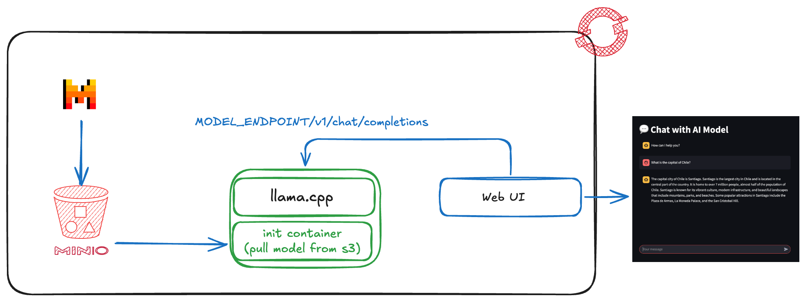

# Rendre un Modèle Disponible en Inférence sur OpenShift avec Llama.cpp



## Introduction

Dans cet article, nous allons explorer comment déployer un modèle de langage pour l'inférence sur OpenShift en utilisant Llama.cpp. Notre architecture globale comprendra un serveur MinIO pour rendre les modèles accessibles via S3, un pod Kubernetes avec un init container pour télécharger le modèle, et un conteneur principal exécutant Llama.cpp pour rendre le modèle disponible pour l'inférence. Enfin, nous déployerons une interface utilisateur pour interagir avec le modèle.

## Prérequis

Avant de commencer, assurez-vous d'avoir les éléments suivants :

1. **Un cluster OpenShift** : Assurez-vous d'avoir accès à un cluster OpenShift.
2. **MinIO** : Un serveur MinIO configuré pour stocker vos modèles.
3. **Outils CLI** : `oc` (OpenShift CLI) et `kubectl` pour interagir avec votre cluster.


## Partie 1 : Téléchargement et Upload du Modèle

### Télécharger Mistral depuis Hugging Face

Pour commencer, téléchargez le modèle de votre choix depuis Hugging Face. Dans notre tutoriel nous utiliserons Mistral-7B. Vous pouvez utiliser la commande suivante pour télécharger le modèle au format GGUF.

```bash
# Exemple de commande pour télécharger un modèle
wget https://huggingface.co/TheBloke/Mistral-7B-Instruct-v0.1-GGUF/resolve/main/mistral-7b-instruct-v0.1.Q4_K_M.gguf?download=true
```

### Upload du Modèle dans MinIO

Une fois le modèle téléchargé et converti, vous devez l'uploader dans votre bucket MinIO. Utilisez l'interface utilisateur de MinIO ou l'outil de ligne de commande `mc` pour uploader le modèle.

```bash
mc cp /path/to/your/model/mistral-7b-instruct-v0.2.Q4_K_M.gguf myminio/mybucket/models/
```

## Partie 2 : Déploiement du Pod Llama.cpp

### Configuration du Pod

Nous allons déployer un pod Kubernetes avec un init container pour télécharger le modèle depuis MinIO et un conteneur principal pour exécuter Llama.cpp.

Voici un exemple de fichier YAML pour le déploiement :

```yaml
apiVersion: apps/v1
kind: Deployment
metadata:
  name: simplified-deployment
  namespace: myllm
spec:
  replicas: 1
  selector:
    matchLabels:
      app: simplified-app
  template:
    metadata:
      labels:
        app: simplified-app
    spec:
      volumes:
        - name: models-volume
          emptyDir: {}
        - name: shm
          emptyDir:
            medium: Memory
            sizeLimit: 2Gi
      initContainers:
        - name: s3-copy
          image: appropriate/curl
          command:
            - sh
            - '-c'
            - 'curl -k -o /mnt/models/mistral-7b-instruct-v0.2.Q4_K_M.gguf https://minio-s3-myllm.apps.neutron-sno-gpu.neutron-it.fr/models/mistral7bv2/mistral-7b-instruct-v0.2.Q4_K_M.gguf'
          volumeMounts:
            - name: models-volume
              mountPath: /mnt/models
      containers:
        - name: main-container
          image: quay.io/neutron-it/custom-model-serving-runtime:latest
          env:
            - name: MODEL_PATH
              value: /mnt/models
            - name: HOST
              value: 0.0.0.0
            - name: PORT
              value: '8080'
          ports:
            - containerPort: 8080
              protocol: TCP
          volumeMounts:
            - name: models-volume
              mountPath: /mnt/models
            - name: shm
              mountPath: /dev/shm
          securityContext:
            runAsUser: 0
```

### Explication

- **Init Container** : Télécharge le modèle depuis MinIO et le place dans un volume partagé.
- **Conteneur Principal** : Exécute Llama.cpp pour rendre le modèle disponible pour l'inférence.

### Service et Route

Pour exposer le service, vous aurez besoin d'un Service et d'une Route :

```yaml
apiVersion: v1
kind: Service
metadata:
  name: simplified-service
  namespace: myllm
spec:
  selector:
    app: simplified-app
  ports:
    - protocol: TCP
      port: 8080
      targetPort: 8080
---
apiVersion: route.openshift.io/v1
kind: Route
metadata:
  name: simplified-route
  namespace: myllm
spec:
  to:
    kind: Service
    name: simplified-service
  port:
    targetPort: 8080
  tls:
    termination: edge
    insecureEdgeTerminationPolicy: Redirect
```

### Test du Service

Vous pouvez tester le service en utilisant `curl` depuis un pod :

```bash
curl --location 'https://localhost:8080/v1/chat/completions' \
--header 'Content-Type: application/json' \
--data '{
  "messages": [
    {
      "content": "You are a helpful assistant.",
      "role": "system"
    },
    {
      "content": "How large is the capital of France?",
      "role": "user"
    }
  ]
}'
```

## Partie 3 : Déploiement de l'Interface Utilisateur

Pour déployer l'interface utilisateur, utilisez le fichier YAML suivant :

```yaml
apiVersion: apps/v1
kind: Deployment
metadata:
  name: chatbot-ui
  namespace: myllm
  labels:
    app: chatbot-ui
spec:
  replicas: 1
  selector:
    matchLabels:
      app: chatbot-ui
  template:
    metadata:
      labels:
        app: chatbot-ui
    spec:
      containers:
        - name: chatbot-ui
          image: 'quay.io/neutron-it/chatbot-ui:latest'
          ports:
            - containerPort: 8080
              protocol: TCP
            - containerPort: 8501
              protocol: TCP
          env:
            - name: MODEL_ENDPOINT
              value: 'http://simplified-service.myrag.svc.cluster.local:8080'
          resources: {}
          imagePullPolicy: Always
      restartPolicy: Always
      terminationGracePeriodSeconds: 30
      dnsPolicy: ClusterFirst
      securityContext: {}
      schedulerName: default-scheduler
  strategy:
    type: RollingUpdate
    rollingUpdate:
      maxUnavailable: 25%
      maxSurge: 25%
  revisionHistoryLimit: 10
  progressDeadlineSeconds: 600
```

### Service et Route pour l'UI

```yaml
apiVersion: v1
kind: Service
metadata:
  name: chatbot-ui
  namespace: myllm
spec:
  ports:
    - name: 8080-tcp
      protocol: TCP
      port: 8080
      targetPort: 8080
    - name: 8501-tcp
      protocol: TCP
      port: 8501
      targetPort: 8501
  selector:
    app: chatbot-ui
---
apiVersion: route.openshift.io/v1
kind: Route
metadata:
  name: chatbot-ui
  namespace: myllm
spec:
  to:
    kind: Service
    name: chatbot-ui
  port:
    targetPort: 8501-tcp
  tls:
    termination: edge
    insecureEdgeTerminationPolicy: Redirect
```

### Exemple de Question

Une fois l'interface utilisateur déployée, vous pouvez poser des questions comme :

- "Quelle est la capitale de la France ?"
- "Peux-tu m'expliquer la théorie de la relativité ?"
- "Quelle est la taille de Paris ?"

---

**Auteur : [Florian EVEN](https://www.linkedin.com/in/florian-even/)**