# Mise en place d'un RAG déconnecté sur OpenShift AI

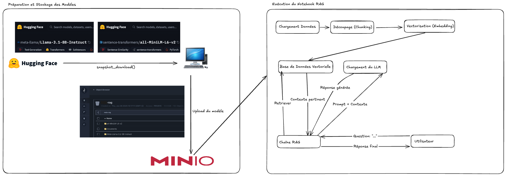

## Introduction

Le RAG (Retrieval-Augmented Generation) est une technique puissante qui permet de connecter un Grand Modèle de Langage (LLM) à une base de connaissance externe. Cela permet au modèle de fournir des réponses précises et factuelles basées sur des documents spécifiques, plutôt que sur ses connaissances générales.

Cet article vous guidera à travers les étapes pour construire, sur la plateforme OpenShift AI, un système RAG complet et déconnecté d'Internet, en utilisant le modèle Llama 3.2, des librairies open-source comme LangChain, et un stockage S3 compatible MinIO.

---

## Code Source

Voici le dépôt GitHub qui contient tout le code utilisé pour l'implémentation de ce RAG. Vous y trouverez le notebook Jupyter complet, prêt à être exécuté.

**[Accéder au notebook sur GitHub](https://github.com/neutron-IT-organization/RAG)**

## 1. Préparation de l'Environnement et des Modèles

La première phase consiste à récupérer tous les composants nécessaires et à les centraliser dans notre entrepôt de données MinIO.

### 1.1. Téléchargement des Modèles depuis Hugging Face
Avant toute chose, nous devons télécharger les modèles qui seront au cœur de notre système. La méthode la plus simple et la plus robuste est de cloner directement leurs dépôts Git. Pour ce projet, nous utilisons :

**`meta-llama/Llama-3.2-3B-Instruct`** : Le LLM qui générera les réponses.
**`sentence-transformers/all-MiniLM-L6-v2`** : Le modèle d'embedding qui transformera notre texte en vecteurs.
Pour ce faire, vous devrez suivre quelques étapes de configuration la première fois.
#### Étape 1 : Obtenir un Jeton d'Accès (Token) Hugging Face 
Le modèle Llama 3.2 est un modèle à accès contrôlé ("gated model"). Pour le télécharger, vous devez accepter ses conditions d'utilisation sur sa page Hugging Face et vous authentifier avec un jeton personnel.

 * Connectez-vous à votre compte sur huggingface.co.
 * Allez sur votre Profil -> Settings -> Access Tokens.
 * Cliquez sur "New token", donnez-lui un nom (ex: **`openshift-downloader`**) et assignez-lui un rôle **`read`**.
 * Copiez le jeton généré (il commence par **`hf_...`**).
#### Étape 2 : S'authentifier dans le Terminal 
Pour que Git puisse utiliser votre jeton, vous devez vous connecter via le terminal de votre machine.

 * Installez l'interface en ligne de commande de Hugging Face si ce n'est pas déjà fait :
```Shell
pip install -U "huggingface_hub[cli]"
```
 * Lancez la commande de connexion :
```Shell
huggingface-cli login
```
  * Collez votre jeton d'accès lorsque vous y êtes invité et appuyez sur Entrée.
#### Étape 3 : Cloner les Dépôts des Modèles 
Maintenant que tout est configuré, vous pouvez cloner les deux dépôts avec les commandes suivantes.
```Shell
# Cloner le modèle Llama 3.2 Instruct
git clone https://huggingface.co/meta-llama/Llama-3.2-3B-Instruct

# Cloner le modèle d'embedding
git clone https://huggingface.co/sentence-transformers/all-MiniLM-L6-v2
```
### 1.2. Centralisation sur MinIO
Une fois les modèles et vos documents sources (PDF, etc.) sur votre machine, l'étape suivante est de les téléverser sur votre serveur MinIO. Cela crée une source de données unique et fiable pour notre application, la rendant indépendante de l'environnement d'exécution.

Créez un bucket (par exemple **`neutronIT-rag`**) et organisez vos fichiers avec des préfixes clairs.
## 2. Initialisation du Notebook et Connexion aux Données
Nous passons maintenant au notebook Jupyter qui orchestre le RAG. 

### 2.1. Installation des Dépendances
Avant toute chose, exécutez la cellule suivante dans votre notebook pour installer toutes les librairies Python requises. Cette commande télécharge et installe l'ensemble des outils nécessaires au fonctionnement de notre RAG.
```python
!pip install huggingface_hub transformers accelerate sentencepiece bitsandbytes langchain langchain-community sentence-transformers chromadb pypdf unstructured pysqlite3-binary langchain-experimental minio
```
### 2.2. Assurer le fonctionnement hors ligne (NLTK)
Pour que notre application soit véritablement déconnectée, nous devons nous assurer que toutes ses dépendances sont disponibles localement. L'outil SemanticChunker, que nous utiliserons plus tard, dépend de la librairie NLTK qui, par défaut, télécharge des paquets de données depuis Internet.

Le code ci-dessous résout ce problème. Il doit être exécuté une première fois avec une connexion Internet. Il va télécharger les paquets punkt (pour la ponctuation) et stopwords (mots courants) dans un dossier local ./nltk_data. Lors des exécutions suivantes, même sans Internet, le script utilisera ce dossier local.
```python 
import os
import nltk
import ssl

nltk_data_dir = "./nltk_data"

if not os.path.exists(nltk_data_dir):
    print(f"Le dossier '{nltk_data_dir}' est introuvable.")
    print("Tentative de téléchargement des paquets NLTK requis ('punkt', 'stopwords')...")
    
    os.makedirs(nltk_data_dir)
    
    try:
        _create_unverified_https_context = ssl._create_unverified_context
    except AttributeError:
        pass
    else:
        ssl._create_default_https_context = _create_unverified_https_context

    nltk.download('punkt', download_dir=nltk_data_dir)
    nltk.download('stopwords', download_dir=nltk_data_dir)
    
    print("Téléchargement des paquets NLTK terminé.")
else:
    print(f"Le dossier '{nltk_data_dir}' existe déjà. Aucune action de téléchargement n'est nécessaire.")

if os.path.abspath(nltk_data_dir) not in nltk.data.path:
    nltk.data.path.append(os.path.abspath(nltk_data_dir))

print("Le script est configuré pour utiliser les paquets NLTK en mode déconnecté.")

```

### 2.3. Connexion à MinIO et Récupération des Modèles
Maintenant que l'environnement est prêt, nous devons établir la connexion entre notre notebook et le serveur MinIO. Pour des raisons de sécurité, les identifiants (clés d'accès) ne sont jamais écrits directement dans le code. Sur OpenShift AI, la méthode recommandée est d'utiliser une "Connexion de données", qui stocke ces informations de manière sécurisée et les rend disponibles pour votre workbench.

Configuration via l'Interface d'OpenShift AI
La connexion se fait en deux temps, directement dans l'interface graphique :

#### 2.3.1 Créer une Connexion de Données : 
Dans votre projet sur OpenShift AI, allez dans la section "Connexions de données" et cliquez sur "Ajouter une connexion de données". Remplissez les champs avec les informations de votre serveur MinIO :

Nom de la connexion : Un nom descriptif (ex: Connexion MinIO Projet RAG).

Access key ID : Votre clé d'accès MinIO.

Secret access key : Votre clé secrète MinIO.

Endpoint : L'URL de votre service MinIO.

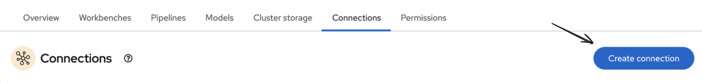{: .scaled-image } 
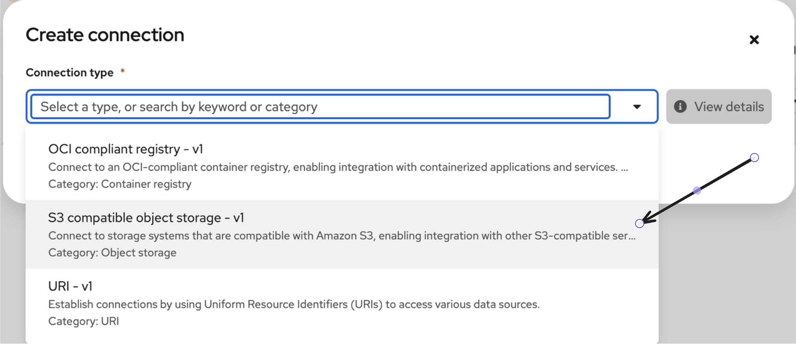{: .scaled-image } 
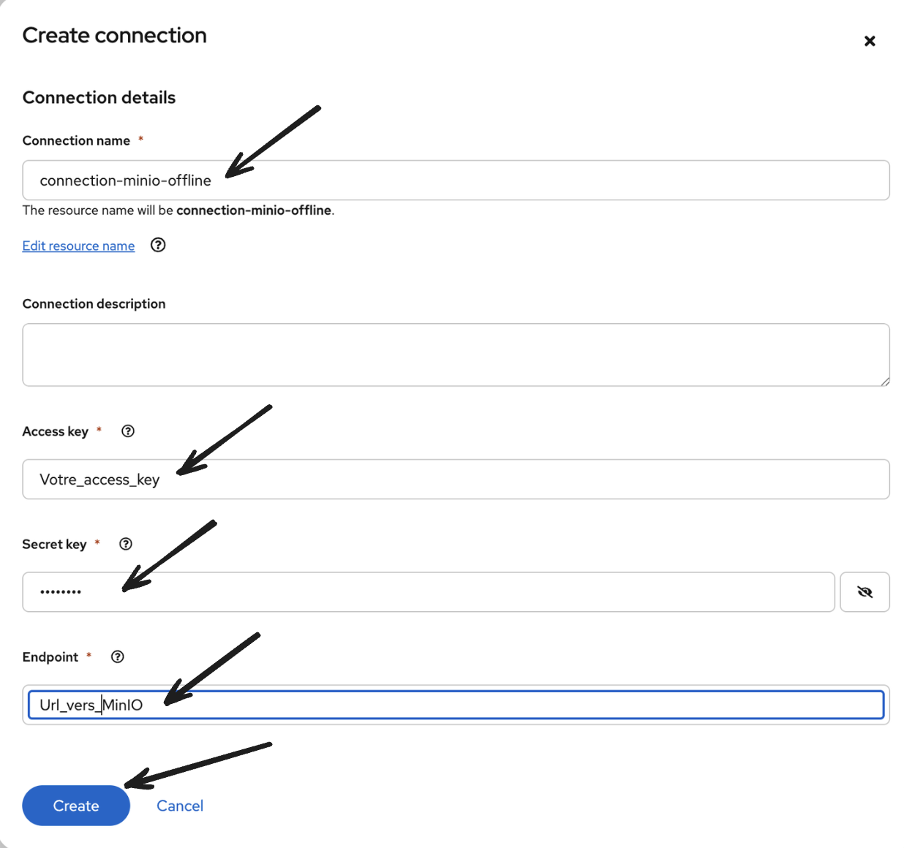{: .scaled-image } 

#### 2.3.2 Lier la Connexion au Workbench : 

Lors de la configuration de votre workbench (ou en le modifiant), descendez jusqu'à la section "Connexions de données". Sélectionnez dans la liste déroulante la connexion que vous venez de créer.

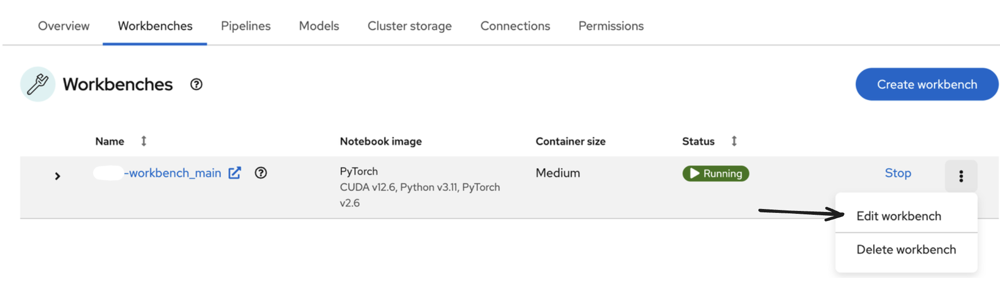{: .scaled-image } 
{: .scaled-image } 
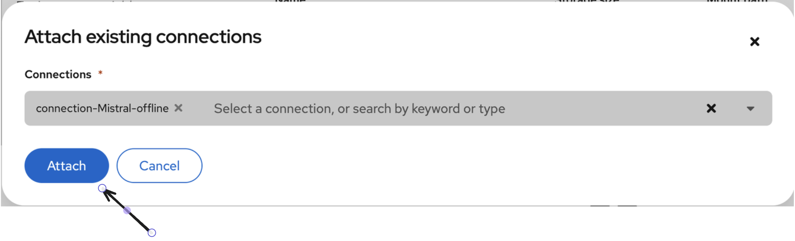{: .scaled-image } 

En faisant cela, OpenShift AI va automatiquement injecter les identifiants de cette connexion comme variables d'environnement (AWS_ACCESS_KEY_ID, AWS_SECRET_ACCESS_KEY, AWS_S3_ENDPOINT) dans l'environnement de votre notebook.

#### 2.3.3 Code d'Utilisation des Variables :

Le code Python ci-dessous peut alors lire ces variables de manière sécurisée grâce à os.getenv(), sans jamais exposer les identifiants dans le code.
```python
import os
from minio import Minio
from minio.error import S3Error

# --- Configuration MinIO ---
MINIO_BUCKET_NAME = "neutronIT-rag"
Access_key = os.getenv("AWS_ACCESS_KEY_ID")
Secret_key = os.getenv("AWS_SECRET_ACCESS_KEY")
s3_endpoint = os.getenv("AWS_S3_ENDPOINT")

# --- Chemins locaux et MinIO ---
LLM_MINIO_PREFIX = "Meta-Llama-3.2-3B-Instruct/"
LLM_LOCAL_PATH = "./models/Meta-Llama-3.2-3B-Instruct"

EMBEDDING_MINIO_PREFIX = "all-MiniLM-L6-v2/"
EMBEDDING_LOCAL_PATH = "./models/all-MiniLM-L6-v2"

def download_model_via_streaming(client, bucket, prefix, local_path):
    """
    Télécharge les fichiers via streaming pour une utilisation mémoire minimale.
    """
    if not os.path.exists(local_path):
        print(f"-> Le dossier '{local_path}' n'existe pas. Début du téléchargement de '{prefix}'...")
        os.makedirs(local_path, exist_ok=True)
        try:
            objects = client.list_objects(bucket, prefix=prefix, recursive=True)
            files_to_download = [obj for obj in objects if not obj.object_name.endswith('/')]

            for obj in files_to_download:
                file_name = os.path.relpath(obj.object_name, prefix)
                local_file_path = os.path.join(local_path, file_name)
                
                if not os.path.exists(os.path.dirname(local_file_path)):
                    os.makedirs(os.path.dirname(local_file_path))
                
                response = None
                try:
                    response = client.get_object(bucket, obj.object_name)
                    with open(local_file_path, 'wb') as file_data:
                        for chunk in response.stream(amt=1024*1024):
                            file_data.write(chunk)
                finally:
                    if response:
                        response.close()
                        response.release_conn()
        except S3Error as exc:
            print(f"   Une erreur S3 est survenue pour {prefix}: {exc}")
            raise
    else:
        print(f"-> Le modèle dans '{local_path}' existe déjà.")

# --- Exécution du téléchargement ---
try:
    minio_client = Minio(s3_endpoint, access_key=Access_key, secret_key=Secret_key, secure=False)
    print("Connexion à MinIO réussie.")
    
    download_model_via_streaming(minio_client, MINIO_BUCKET_NAME, LLM_MINIO_PREFIX, LLM_LOCAL_PATH)
    download_model_via_streaming(minio_client, MINIO_BUCKET_NAME, EMBEDDING_MINIO_PREFIX, EMBEDDING_LOCAL_PATH)
    
except Exception as e:
    print(f"Une erreur est survenue lors de la phase de téléchargement : {e}")

print("\n Tous les modèles sont vérifiés et prêts localement.")
```

 -> Résultat :

 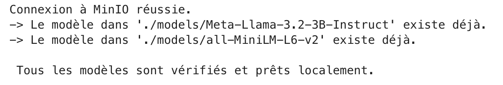{: .scaled-image } 
## 3. Chargement et Configuration des Modèles IA
Avec les fichiers de modèles disponibles localement, nous pouvons maintenant les charger en mémoire.

Pour le LLM, une technique de quantification 4-bit (**`BitsAndBytesConfig`**) est utilisée. Elle réduit drastiquement l'empreinte mémoire du modèle sur le GPU, le rendant utilisable sur des configurations plus modestes, sans perte de performance significative.
```python
import torch
from transformers import AutoTokenizer, AutoModelForCausalLM, BitsAndBytesConfig
from langchain_community.embeddings import SentenceTransformerEmbeddings

# 1. Configuration de la quantification 4-bit
nf4_config = BitsAndBytesConfig(
    load_in_4bit=True,
    bnb_4bit_quant_type="nf4",
    bnb_4bit_use_double_quant=True,
    bnb_4bit_compute_dtype=torch.float16
)

# 2. Chargement du tokenizer du LLM
print(f"Chargement du tokenizer depuis le chemin local : {LLM_LOCAL_PATH}...")
tokenizer = AutoTokenizer.from_pretrained(
    LLM_LOCAL_PATH,
    trust_remote_code=True,
    local_files_only=True
)
if tokenizer.pad_token is None:
    tokenizer.pad_token = tokenizer.eos_token

# 3. Chargement du modèle LLM quantifié
print(f"Chargement du modèle depuis {LLM_LOCAL_PATH} avec quantisation 4-bit...")
model = AutoModelForCausalLM.from_pretrained(
    LLM_LOCAL_PATH,
    quantization_config=nf4_config,
    device_map="auto",
    trust_remote_code=True,
    torch_dtype=torch.bfloat16,
    low_cpu_mem_usage=True,
    local_files_only=True
)
print("Modèle LLM chargé avec succès !")

# 4. Chargement du modèle d'embedding
embeddings = SentenceTransformerEmbeddings(
    model_name=EMBEDDING_LOCAL_PATH, 
    model_kwargs={'device': 'cuda'}
)
print("Modèle d'embedding chargé avec succès !")
```

 -> Résultats :
 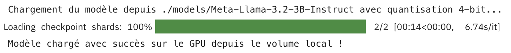{: .scaled-image } 
## 4. Pipeline d'Ingestion des Données (Le "Retrieval")

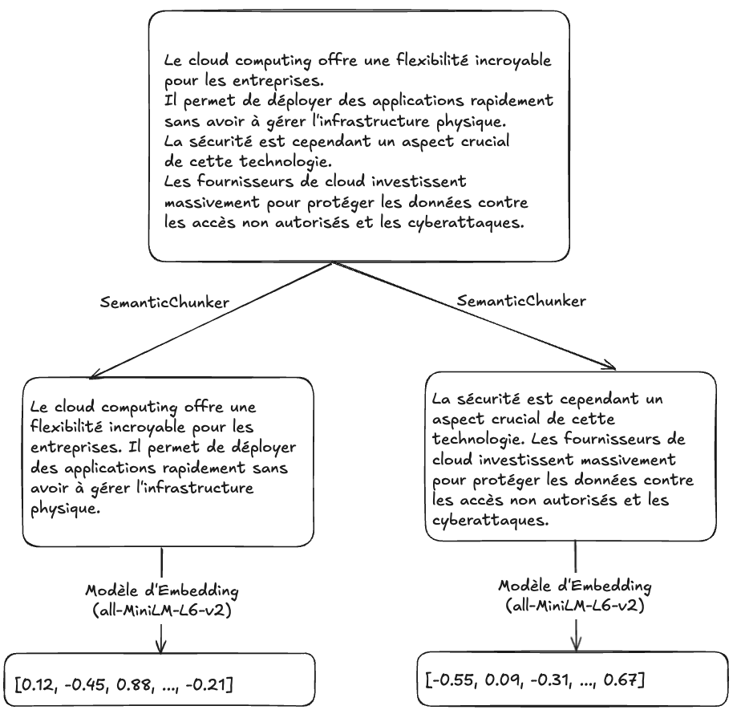{: .scaled-image } 

Cette étape transforme nos documents bruts en une base de connaissance interrogeable. Elle se déroule en trois temps : l'extraction du texte, le découpage sémantique, et enfin la vectorisation.

### 4.1. Chargement et Extraction des Documents
La première action consiste à récupérer les documents sources (ici, des PDF) depuis notre stockage MinIO. Le script parcourt le dossier **`documents/`**, télécharge chaque fichier localement, puis utilise la librairie **`PyPDFLoader`**. C'est la méthode **`loader.load()`** qui se charge d'ouvrir chaque PDF et d'en extraire le contenu textuel brut, page par page.
```python
from langchain_community.document_loaders import PyPDFLoader

# 1. Chargement et extraction des documents PDF depuis MinIO
PDF_DIRECTORY_ON_MINIO = "documents/"
LOCAL_PDF_DOWNLOAD_DIR = "./pdf_downloads/"
all_documents = []
os.makedirs(LOCAL_PDF_DOWNLOAD_DIR, exist_ok=True)

pdf_objects = minio_client.list_objects(MINIO_BUCKET_NAME, prefix=PDF_DIRECTORY_ON_MINIO, recursive=True)
pdf_object_names = [obj.object_name for obj in pdf_objects if obj.object_name.lower().endswith('.pdf')]

for pdf_object_name in pdf_object_names:
    local_pdf_path = os.path.join(LOCAL_PDF_DOWNLOAD_DIR, os.path.basename(pdf_object_name))
    if not os.path.exists(local_pdf_path):
        minio_client.fget_object(MINIO_BUCKET_NAME, pdf_object_name, local_pdf_path)
    
    # La librairie PyPDFLoader s'occupe ici de l'extraction du texte
    loader = PyPDFLoader(local_pdf_path)
    documents_from_this_pdf = loader.load()
    all_documents.extend(documents_from_this_pdf)

print(f"Traitement terminé. Nombre total de pages prêtes pour le RAG : {len(all_documents)}")
```

 -> Résultats :
 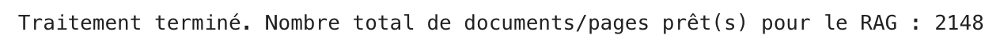{: .scaled-image } 
### 4.2. Découpage Sémantique du Texte
Une fois le texte extrait, il est trop volumineux pour être envoyé tel quel à un LLM. Nous devons le diviser en plus petits morceaux ("chunks"). Plutôt qu'un découpage arbitraire, nous utilisons **`SemanticChunker`**. Cet outil analyse le texte et le coupe aux endroits où le sens change, créant ainsi des chunks plus cohérents et pertinents pour la recherche d'informations.
```python
from langchain_experimental.text_splitter import SemanticChunker

# 2. Découpage sémantique
print("Découpage des documents en chunks sémantiques...")
text_splitter = SemanticChunker(embeddings, breakpoint_threshold_type="percentile")
all_chunks = text_splitter.split_documents(all_documents)
print(f"Nombre total de chunks créés : {len(all_chunks)}")
```

 -> Résultats :
 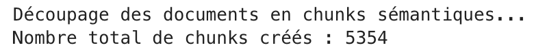{: .scaled-image } 
### 4.3. Vectorisation et Stockage
C'est la dernière étape de la préparation. Chaque chunk de texte est transformé en un vecteur numérique (un "embedding") à l'aide de notre modèle **`all-MiniLM-L6-v2`**. Ces vecteurs sont ensuite stockés et indexés dans une base de données vectorielle, ChromaDB, qui nous permettra de retrouver efficacement les chunks les plus pertinents par rapport à une question.
```python
from langchain_community.vectorstores import Chroma

# 3. Vectorisation et stockage dans ChromaDB
print("Initialisation du Vector Store (ChromaDB) avec les chunks...")
vectorstore = Chroma.from_documents(documents=all_chunks, embedding=embeddings)
print("Vector Store prêt !")
```
## 5. Construction de la Chaîne de Génération (Le "Augmented Generation")
Maintenant que notre base de connaissance est prête, nous assemblons la chaîne RAG.
```python
from langchain_core.retrievers import BaseRetriever
from langchain_core.prompts import ChatPromptTemplate
from langchain.chains import create_retrieval_chain
from langchain.chains.combine_documents import create_stuff_documents_chain
from langchain_community.llms import HuggingFacePipeline
from transformers import pipeline
from typing import List

# 1. Retriever Personnalisé (`NeighborRetriever`)
class NeighborRetriever(BaseRetriever):
    vectorstore: Chroma
    all_docs: List

    def _get_relevant_documents(self, query: str, *, run_manager) -> List:
        best_docs = self.vectorstore.similarity_search(query, k=1)
        if not best_docs: return []
        
        try:
            best_doc_index = [doc.page_content for doc in self.all_docs].index(best_docs[0].page_content)
        except ValueError:
            return best_docs
        
        start_index = max(0, best_doc_index - 1)
        end_index = min(len(self.all_docs), best_doc_index + 2)
        return self.all_docs[start_index:end_index]

retriever = NeighborRetriever(vectorstore=vectorstore, all_docs=all_chunks)
print("Retriever à contexte enrichi (voisins) prêt !")


# 2. Pipeline de génération et Prompt Template
text_generation_pipeline = pipeline("text-generation", model=model, tokenizer=tokenizer, max_new_tokens=4096)
llm = HuggingFacePipeline(pipeline=text_generation_pipeline)

prompt_template_str = """<|begin_of_text|><|start_header_id|>system<|end_header_id|>
Tu es un assistant utile. Pour répondre, réfère-toi d'abord au CONTEXTE FOURNI.
Si la réponse NE SE TROUVE PAS dans le contexte, utilise tes propres connaissances.
Si tu ne connais pas la réponse, dis simplement que tu ne sais pas.<|eot_id|><|start_header_id|>user<|end_header_id|>
Contexte:
{context}

Question: {input}<|eot_id|><|start_header_id|>assistant<|end_header_id|>
"""
prompt = ChatPromptTemplate.from_template(prompt_template_str)


# 3. Assemblage de la chaîne RAG
document_chain = create_stuff_documents_chain(llm, prompt)
retrieval_chain = create_retrieval_chain(retriever, document_chain)
print("Chaîne RAG complète assemblée !")
```
## 6. Itération et Comparaison des Résultats
Le système est prêt. L'étape finale du notebook lance une boucle interactive où, pour chaque question de l'utilisateur, le script utilise d'abord le LLM pour reformuler et améliorer la question, la rendant plus précise pour la recherche. Ensuite, cette question optimisée est envoyée à la fois au LLM seul pour une réponse générale, et à la chaîne RAG pour une réponse basée sur le contexte de nos documents. Cela permet de comparer en temps réel la connaissance intrinsèque du modèle avec les réponses factuelles et précises fournies par le RAG.
```python
def transform_query_with_llm(question: str, model, tokenizer) -> str:
    transformation_prompt_template = """<|begin_of_text|><|start_header_id|>system<|end_header_id|>
    Tu es un outil de reformulation de requêtes. Ton seul rôle est de réécrire la question de l'utilisateur pour la rendre optimale pour une recherche sémantique.
    Règles strictes:
    1. Ne réponds JAMAIS à la question.
    2. Garde le sens original de la question.
    3. Ta sortie doit être une et une seule question.
    4. La question reformulée doit être concise.
    
    Exemple 1:
    Utilisateur: infos sur la sécurité openshift
    Assistant: Quelles sont les meilleures pratiques de sécurité pour un cluster OpenShift ?
    
    Exemple 2:
    Utilisateur: tu peux me faire un résumé ?
    Assistant: Quel est le résumé du document fourni ?
    
    Exemple 3:
    Utilisateur: c'est quoi les grands titre dont tu peux m'aider, en se basant sur le contexte?
    Assistant: Quels sont les thèmes principaux abordés dans le document ?<|eot_id|><|start_header_id|>user<|end_header_id|>
    {question}<|eot_id|><|start_header_id|>assistant<|end_header_id|>
    """
    formatted_prompt = transformation_prompt_template.format(question=question)
    inputs = tokenizer(formatted_prompt, return_tensors="pt").to(model.device)
    outputs = model.generate(**inputs, max_new_tokens=150, pad_token_id=tokenizer.eos_token_id)
    transformed_question = tokenizer.decode(outputs[0][inputs.input_ids.shape[1]:], skip_special_tokens=True)
    return transformed_question.strip()


def get_direct_llm_answer(question, model, tokenizer):
    messages = [{"role": "user", "content": question}]
    prompt_for_direct_answer = tokenizer.apply_chat_template(messages, tokenize=False, add_generation_prompt=True)
    inputs = tokenizer(prompt_for_direct_answer, return_tensors="pt").to(model.device)
    outputs = model.generate(**inputs, max_new_tokens=4096, pad_token_id=tokenizer.eos_token_id)
    answer = tokenizer.decode(outputs[0][inputs.input_ids.shape[1]:], skip_special_tokens=True)
    return answer

# --- Boucle d'interaction principale ---
print("\n\n Système RAG prêt. Posez une question (tapez 'exit' pour quitter) :")
while True:
    try:
        prompt_text = input(">>> ")
        if prompt_text.lower() == 'exit':
            break
            
        print("\n--- Transformation de la question par le LLM ---")
        transformed_query = transform_query_with_llm(prompt_text, model, tokenizer)
        print(f"Question transformée : '{transformed_query}'")
        
        print("\n--- Réponse du Modèle Llama (Connaissances Générales) ---")
        answer_direct = get_direct_llm_answer(transformed_query, model, tokenizer)
        print(f"Modèle Llama (Direct) : {answer_direct.strip()}")

        print("\n--- Réponse du RAG (Basée sur le Contexte du Fichier) ---")
        response_rag = retrieval_chain.invoke({"input": transformed_query})
        print(f"Modèle RAG : {response_rag['answer'].strip()}")

    except KeyboardInterrupt:
        print("\nFermeture.")
        break
    except Exception as e:
        print(f"Une erreur est survenue : {e}")
        break
```

 -> Résultats :
 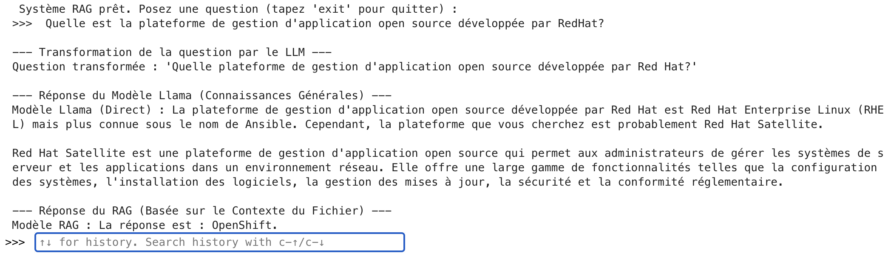
## Conclusion
Cet article vous a guidé à travers la mise en place d'un système RAG performant, déconnecté et entièrement open-source. Vous avez appris à préparer les modèles, à les centraliser sur MinIO, à construire un pipeline d'ingestion de données sémantique et à assembler une chaîne de génération avancée. La clé est maintenant d'expérimenter avec vos propres documents, d'ajuster les paramètres du prompt ou même de tester différents retrievers pour affiner encore plus les performances de votre assistant IA.
Dans cet exemple, j’ai utilisé le modèle Llama 3B de Meta-Llama, qui reste relativement léger. Bien qu’il permette d’illustrer le fonctionnement général du système, ses capacités sont limitées et ne permettent pas toujours d’obtenir des réponses puissantes ou très détaillées. En utilisant un modèle plus performant (comme Llama 7B, Mistral 7B ou Mixtral), vous pourrez obtenir des résultats bien plus pertinents et qualitatifs.

---

**Auteur : [Mohamed-Reda BOUAMOUD](https://www.linkedin.com/in/mohamed-reda-bouamoud-1297a3248/)**