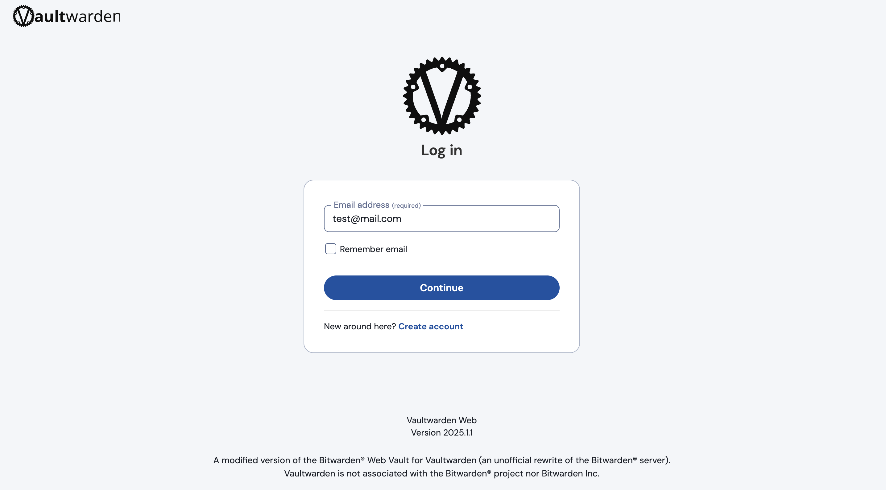
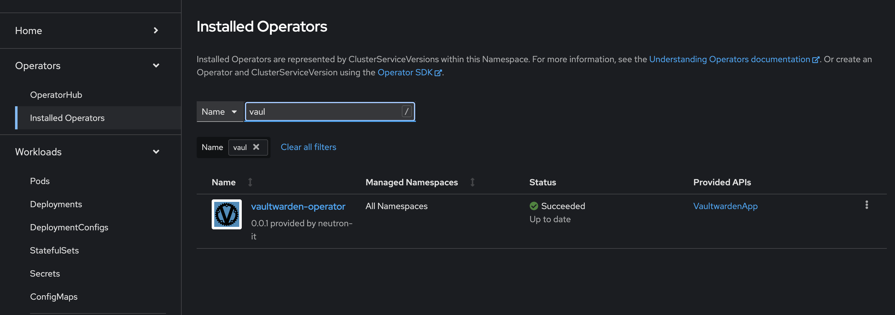
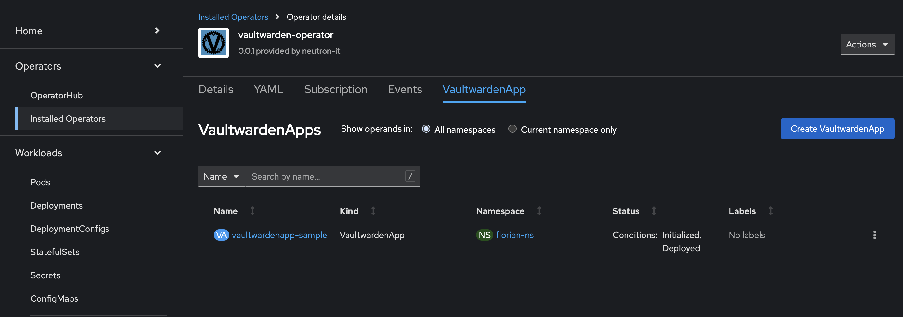

# Création d'un Operator sur OpenShift avec Vaultwarden

## Introduction

Les Operators sont devenus un élément essentiel dans l'écosystème Kubernetes, permettant d'automatiser les tâches de gestion des applications. Dans cet article, nous allons créer un Operator pour Vaultwarden, une implémentation open-source de Bitwarden, et le déployer sur OpenShift. Pour cela, nous utiliserons l'Operator SDK avec le plugin Helm.



## Qu'est-ce que Vaultwarden ?

Vaultwarden est une alternative open-source à Bitwarden, un gestionnaire de mots de passe populaire. Il permet aux utilisateurs d'auto-héberger leur propre serveur de gestion de mots de passe, offrant ainsi un contrôle total sur leurs données sensibles.

## Prérequis

### Installer l'Operator SDK

Pour créer notre Operator, nous devons d'abord installer l'Operator SDK. Voici comment procéder :

1. **Télécharger et installer l'Operator SDK :**

```bash
curl -LO https://github.com/operator-framework/operator-sdk/releases/download/v1.25.0/operator-sdk_linux_amd64
chmod +x operator-sdk_linux_amd64
sudo mv operator-sdk_linux_amd64 /usr/local/bin/operator-sdk
```

2. **Vérifier l'installation :**

```bash
operator-sdk version
```

### Droits Administratifs sur le Cluster OpenShift

Assurez-vous d'avoir les droits administratifs nécessaires sur votre cluster OpenShift pour créer et gérer des Operators.

## Étapes de Création de l'Operator

### Initialiser le Projet

Utilisez l'Operator SDK pour initialiser un nouveau projet d'Operator avec le plugin Helm.

```bash
operator-sdk init --domain neutron-it --plugins helm --group vaultwarden --version v2alpha1 --kind VaultwardenApp --helm-chart=../vaultwarden-helm
```

### Configurer les Rôles RBAC

Modifiez le fichier `config/rbac/role.yaml` pour accorder les droits nécessaires à l'Operator. Dans notre cas, nous allons donner des droits administratifs au `manager-role`.

```yaml
apiVersion: rbac.authorization.k8s.io/v1
kind: ClusterRole
metadata:
  name: manager-role
rules:
  - apiGroups:
      - "*"
    resources:
      - "*"
    verbs:
      - "*"
```

### Ajuster les Ressources du Manager

Dans le fichier `config/manager/manager.yaml`, augmentez la limite de mémoire pour le Manager.

```yaml
resources:
  limits:
    memory: 1024Mi
```

### Construire et Pousser l'Image Docker

Construisez l'image Docker de l'Operator et poussez-la vers votre registre.

```bash
make docker-build docker-push IMG="quay.io/neutron-it/vaultwarden-operator:v0.0.6"
```

### Créer et Pousser le Bundle

Créez le bundle de l'Operator et poussez-le vers le registre.

```bash
make bundle IMG="quay.io/neutron-it/vaultwarden-operator:v0.0.6"
make bundle-build bundle-push BUNDLE_IMG="quay.io/neutron-it/vaultwarden-operator-bundle:v0.0.6" IMG="quay.io/neutron-it/vaultwarden-operator:v0.0.6"
```

### Exécuter le Bundle

Exécutez le bundle pour installer l'Operator sur votre cluster OpenShift.

```bash
operator-sdk run bundle "quay.io/neutron-it/vaultwarden-operator-bundle:v0.0.6"
```

## Déploiement de VaultwardenApp

1. **Accédez à l'interface utilisateur d'OpenShift.**
2. **Allez dans la section "Installed Operators".**



3. **Créez une instance de `VaultwardenApp` avec la configuration suivante :**

```yaml
apiVersion: vaultwarden.neutron-it/v2alpha1
kind: VaultwardenApp
metadata:
  name: vaultwardenapp-sample
  namespace: neutron-it-ns
spec:
  config:
    DATA_FOLDER: /data
    INVITATIONS_ALLOWED: 'true'
    ROCKET_PORT: '8080'
    ROCKET_WORKERS: '10'
    SHOW_PASSWORD_HINT: 'false'
    SIGNUPS_ALLOWED: 'true'
    SMTP_FROM: demonstration@yourdomain.fr
    SMTP_HOST: aspmx.l.google.com
    SMTP_PORT: '25'
    SMTP_SECURITY: 'off'
    WEBSOCKET_ENABLED: 'true'
    WEB_VAULT_ENABLED: 'true'
    YUBICO_CLIENT_ID: '123123'
    YUBICO_SECRET_KEY: 12345678
  consoleLink:
    enabled: true
    imageURL: 'https://upload.wikimedia.org/wikipedia/commons/8/83/Vaultwarden_icon.svg'
    section: secret console link
    text: Vaultwarden
  domain: 'https://vaultwarden.apps.neutron-sno-office.intraneutron.fr'
  image:
    pullPolicy: IfNotPresent
    repository: vaultwarden/server
    tag: latest
  persistence:
    accessModes:
      - ReadWriteOnce
    enabled: true
    size: 10Gi
  rbac:
    create: true
  replicaCount: 1
  resources: {}
  route:
    enabled: true
    tls:
      termination: edge
    wildcardPolicy: None
  service:
    ports:
      - name: http
        port: 80
        targetPort: 8080
      - name: websocket
        port: 3012
        targetPort: 3012
    type: ClusterIP
  serviceAccount:
    create: true
    name: vaultwarden
```



Maintenant, vous pouvez vous rendre dans la section "Console Links" de l'interface OpenShift, cliquer sur "Vaultwarden" et accéder directement à l'interface de Vaultwarden pour commencer à l'utiliser.


## Conclusion

En suivant ces étapes, vous avez créé et déployé un Operator pour Vaultwarden sur OpenShift. Cet Operator automatise la gestion de Vaultwarden, facilitant ainsi le déploiement et la maintenance de l'application. Vous pouvez maintenant profiter des fonctionnalités de Vaultwarden tout en bénéficiant de l'automatisation offerte par les Operators Kubernetes.

---

**Auteur : [Florian EVEN](https://www.linkedin.com/in/florian-even/)**
